# CC-Middleware

An early alpha `v0.1.0` Node/TypeScript middleware for managing and observing Claude Code sessions through a REST API, WebSocket streams, a CLI, and plugin hooks.

CC-Middleware sits between your application and Claude Code so you can launch and resume sessions programmatically, subscribe to lifecycle events, manage permissions, search session history, and expose agent or team metadata from one place. The API is already useful for real workflows, but the release should still be treated as early alpha software.

## What You Can Build With It

- Session management for headless or resumed Claude Code runs
- Hook-driven automations that react to tool usage and lifecycle events
- Approval workflows for permission requests
- Search and indexing over local session history
- Real-time dashboards powered by WebSocket sync events
- Plugin-backed observability for interactive Claude Code sessions

## Features

- Session discovery, launch, resume, abort, and streaming
- Hook event dispatch for lifecycle events such as `PreToolUse`, `PostToolUse`, `SessionStart`, and `Stop`
- Permission policy handling with pending request resolution
- Agent and team definition discovery
- SQLite-backed session indexing and search
- Real-time filesystem sync for sessions and config changes
- REST API and WebSocket server built with Fastify
- CLI commands via `ccm`
- Mintlify documentation site in `docs-site/`

## Project Structure

```mermaid
flowchart TD
    root["CC-Middleware"]
    src["src/"]
    docsSite["docs-site/"]
    docs["docs/"]
    tests["tests/"]

    root --> src
    root --> docsSite
    root --> docs
    root --> tests

    src --> api["api/ - REST and WebSocket routes"]
    src --> agents["agents/ - Agent definition reader and team launcher"]
    src --> cli["cli/ - Command-line interface"]
    src --> config["config/ - Settings, plugins, MCP, memory, components"]
    src --> hooks["hooks/ - Event bus and hook server"]
    src --> permissions["permissions/ - Tool approval and policy handling"]
    src --> sessions["sessions/ - Session discovery, launch, resume, messages, streaming"]
    src --> store["store/ - SQLite session index"]
    src --> sync["sync/ - Real-time file watchers and auto-indexer"]
    src --> types["types/ - Shared TypeScript types"]

    docsSite --> docsSiteDesc["Mintlify documentation source"]
    docs --> docsDesc["Architecture notes, research, and planning docs"]
    tests --> testsDesc["Unit, integration, and E2E coverage"]
```



## Requirements

- Node.js 20+
- Claude Code CLI installed and authenticated
- A valid auth context for `@anthropic-ai/claude-agent-sdk`

## Quick Start

```bash
git clone git@github.com:juanbermudez/cc-middleware.git
cd cc-middleware
npm install
npm run build
npm start
```

The default local services are:

- API server: `http://127.0.0.1:3000`
- Hook server: `http://127.0.0.1:3001`

To verify the API is up:

```bash
curl http://127.0.0.1:3000/health
```

## Example Usage

List recent sessions:

```bash
curl "http://127.0.0.1:3000/api/v1/sessions?limit=5"
```

Launch a headless session:

```bash
curl -X POST http://127.0.0.1:3000/api/v1/sessions \
  -H "Content-Type: application/json" \
  -d '{
    "prompt": "What is 2 + 2?",
    "maxTurns": 1,
    "permissionMode": "plan"
  }'
```

Use the CLI instead:

```bash
npx ccm sessions launch "Explain the Fibonacci sequence" --stream
```

## Development

Install dependencies and use the standard scripts:

```bash
npm install
npm run build
npm run dev
npm test
npm run lint
```

Additional test commands:

```bash
npm run test:unit
npm run test:e2e
```

## Documentation

The docs site is built with Mintlify from `docs-site/`.

Run the docs locally:

```bash
npm run docs:dev
```

Validate the docs build:

```bash
npm run docs:validate
```

Mintlify deployment notes for this repo live in [`docs/MINTLIFY_DEPLOY.md`](docs/MINTLIFY_DEPLOY.md).

## Architecture

High-level architecture docs are in [`docs/architecture/README.md`](docs/architecture/README.md). The project is organized around a few core subsystems:

- `sessions`: discover, launch, and stream Claude Code sessions
- `hooks`: route lifecycle events into a central event bus
- `permissions`: evaluate tool usage and handle pending approvals
- `agents`: expose agent definitions and team metadata
- `sync`: watch filesystem changes and push real-time updates
- `store`: index and query session history with SQLite

## Contributing

Issues and pull requests are welcome.

If you want to contribute:

1. Fork the repo and create a feature branch.
2. Run the test suite and lint checks locally.
3. If you changed docs, run `npm run docs:validate`.
4. Open a pull request with a clear summary of the behavior change.

## Status

This repository is published as early alpha `v0.1.0`.

The codebase is active and includes unit, integration, and E2E coverage, along with a Mintlify docs site and generated API reference assets. Expect the API and docs surface to keep evolving as the project matures.

## Repository

GitHub: [juanbermudez/cc-middleware](https://github.com/juanbermudez/cc-middleware)
