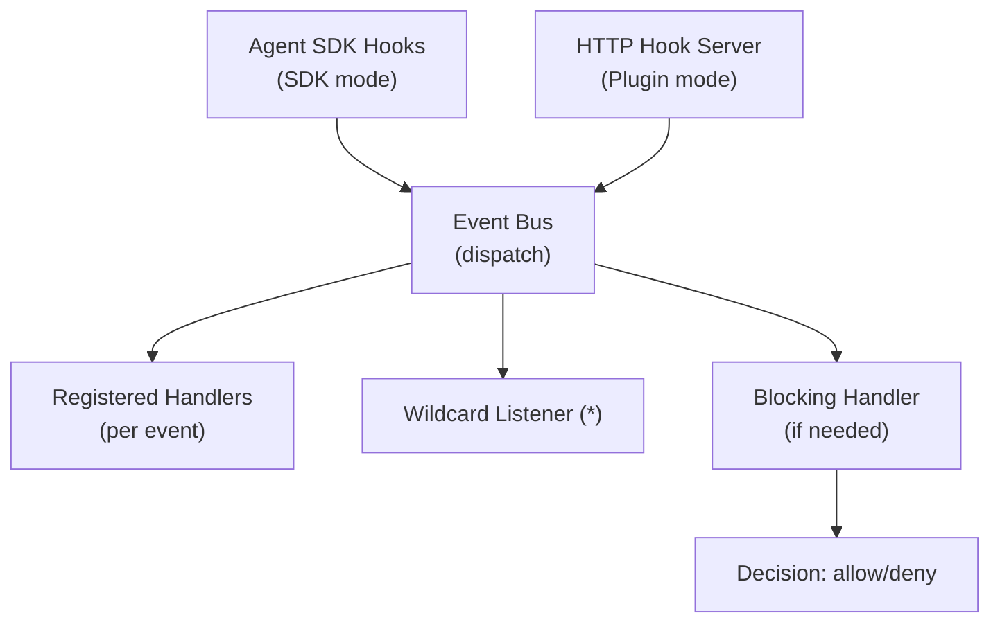

# Hook Events

The event system dispatches Claude Code lifecycle events through a typed event bus, with blocking hook support, SDK integration, and an HTTP hook server for plugin mode.

## Supported Event Types

The event bus supports all Claude Code hook event types plus a wildcard `*` listener:

| Event Type | Blocking | Description |
|------------|----------|-------------|
| `PreToolUse` | Yes | Before a tool is executed. Can deny the tool call. |
| `PostToolUse` | No | After a tool executes successfully |
| `PostToolUseFailure` | No | After a tool execution fails |
| `SessionStart` | No | When a session begins |
| `SessionEnd` | No | When a session ends |
| `UserPromptSubmit` | No | When a user submits a prompt |
| `Stop` | Yes | When the agent wants to stop. Block to continue conversation. |
| `StopFailure` | No | When a stop attempt fails |
| `SubagentStart` | No | When a sub-agent is launched |
| `SubagentStop` | No | When a sub-agent stops |
| `TaskCreated` | No | When a team task is created |
| `TaskCompleted` | Yes | When a team task completes. Block to continue. |
| `TeammateIdle` | Yes | When a teammate becomes idle. Block to assign new work. |
| `PermissionRequest` | Yes | When a permission decision is needed |
| `PermissionDenied` | No | When a permission is denied |
| `Notification` | No | General notification from Claude Code |
| `ConfigChange` | No | When configuration changes |
| `CwdChanged` | No | When the working directory changes |
| `FileChanged` | No | When a file is modified |
| `WorktreeCreate` | No | When a git worktree is created |
| `WorktreeRemove` | No | When a git worktree is removed |
| `PreCompact` | No | Before context compaction |
| `PostCompact` | No | After context compaction |
| `Elicitation` | No | When Claude asks the user a question |
| `ElicitationResult` | No | When an elicitation is answered |

## Event Flow



## Blocking Hooks

Blocking hooks can prevent actions in Claude Code. Every blocking event has a **stub handler** that returns a positive (allow) response by default, making the middleware transparent.

Custom handlers override these stubs. For tool events (PreToolUse, PostToolUse), handlers can specify a regex matcher on tool name, and multiple handlers with different matchers can coexist.

### Hook Output Format

All hook callbacks return `HookJSONOutput` (or `{}` to proceed with no changes):

```typescript
{
  systemMessage?: string;              // Inject message visible to model
  continue?: boolean;                  // Control if agent keeps running
  decision?: "approve" | "block";      // For Stop/TaskCompleted/TeammateIdle
  reason?: string;                     // Explanation for decision
  hookSpecificOutput?: {
    hookEventName: string;             // REQUIRED - must match event type
    // ... event-specific fields
  }
}
```

### Per-Event Blocking Formats

<AccordionGroup>
  <Accordion title="PreToolUse - Deny a tool call">
    ```json
    {
      "hookSpecificOutput": {
        "hookEventName": "PreToolUse",
        "permissionDecision": "deny",
        "permissionDecisionReason": "Dangerous operation not allowed"
      }
    }
    ```
  </Accordion>

  <Accordion title="PermissionRequest - Deny a permission">
    ```json
    {
      "hookSpecificOutput": {
        "hookEventName": "PermissionRequest",
        "decision": { "behavior": "deny" }
      }
    }
    ```
  </Accordion>

  <Accordion title="Stop - Block stop (continue conversation)">
    ```json
    {
      "decision": "block",
      "reason": "Please also handle edge cases"
    }
    ```
  </Accordion>

  <Accordion title="TaskCompleted / TeammateIdle - Block completion">
    ```json
    {
      "decision": "block",
      "reason": "Assign additional verification work"
    }
    ```
  </Accordion>

  <Accordion title="Default (all events) - Proceed">
    ```json
    {}
    ```
  </Accordion>
</AccordionGroup>

<Warning>
  `HookJSONOutput` (hook callbacks) is a **different type** from `PermissionResult` (canUseTool callback). Do not confuse them:
  - Hook callbacks return `HookJSONOutput` -- `{}` or `{ hookSpecificOutput: ... }`
  - `canUseTool` returns `PermissionResult` -- `{ behavior: "allow" }` or `{ behavior: "deny", message: "..." }`
</Warning>

## Hook Input Contract

All hook inputs extend a base shape:

```typescript
{
  session_id: string;
  transcript_path: string;
  cwd: string;
  permission_mode?: string;
  hook_event_name: string;
  agent_id?: string;
  agent_type?: string;
}
```

Tool-related events add `toolName`, `toolInput`, and `toolUseID` fields.

## SDK Bridge

When launching sessions via `query()`, the SDK bridge converts middleware event registrations into Agent SDK `hooks` option format. It generates `HookCallbackMatcher[]` entries that:

1. Dispatch events to the event bus (for observability)
2. Execute blocking handlers (for control)
3. Return `HookJSONOutput` to the SDK

This happens automatically when you launch sessions through the Session Manager.

## HTTP Hook Server

The HTTP hook server runs on a separate port (default 3001) and receives hook events from Claude Code's HTTP hook system in plugin mode.

When a hook event arrives:

1. The server parses the hook input JSON from the request body
2. Dispatches the event to the event bus
3. For blocking events, executes the blocking handler
4. Returns the result as an HTTP response

### HTTP Hook Response Protocol

| Response | Meaning |
|----------|---------|
| HTTP 200 with `{}` or empty body | Proceed (equivalent to command hook exit 0) |
| HTTP 200 with `{ hookSpecificOutput: { permissionDecision: "deny" } }` | Block tool (equivalent to exit 2) |
| HTTP 200 with `{ decision: "block" }` | Block Stop/TaskCompleted/etc. |
| Non-2xx or timeout | Non-blocking error (Claude continues anyway) |

## WebSocket Event Streaming

Events are also available via WebSocket at `ws://127.0.0.1:3000/api/v1/ws`:

```typescript
// Subscribe to all hook events
ws.send(JSON.stringify({ type: "subscribe", events: ["hook:*"] }));

// Or specific event types
ws.send(JSON.stringify({ type: "subscribe", events: ["hook:PreToolUse", "hook:Stop"] }));
```

Server sends:

```json
{
  "type": "hook:event",
  "eventType": "PreToolUse",
  "input": {
    "session_id": "abc123",
    "toolName": "Bash",
    "toolInput": "ls -la",
    "cwd": "/path/to/project"
  }
}
```

## Webhook Subscriptions

Register HTTP webhook URLs to receive events via POST:

<CodeGroup>
```bash Register webhook
curl -X POST http://127.0.0.1:3000/api/v1/events/subscribe \
  -H "Content-Type: application/json" \
  -d '{
    "url": "https://your-server.com/webhook",
    "events": ["PreToolUse", "Stop"],
    "headers": {"Authorization": "Bearer token123"},
    "secret": "webhook-secret"
  }'
```

```bash List subscriptions
curl http://127.0.0.1:3000/api/v1/events/subscriptions
```

```bash Remove subscription
curl -X DELETE http://127.0.0.1:3000/api/v1/events/subscriptions/{id}
```
</CodeGroup>

Webhook subscriptions are in-memory and do not persist across server restarts.
