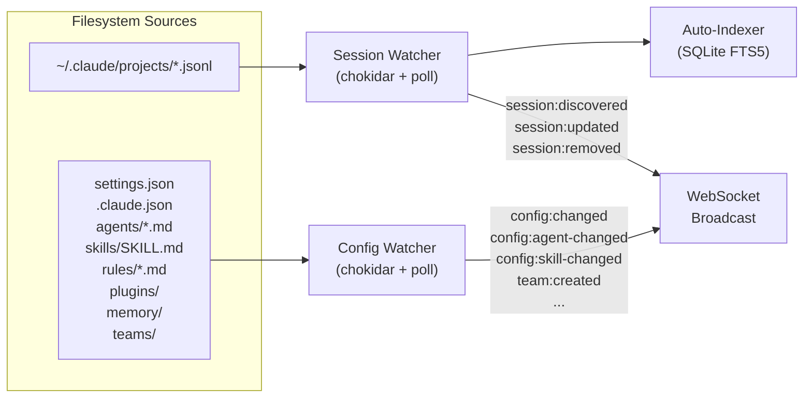

# Real-Time Sync

CC-Middleware continuously monitors the filesystem for changes to Claude Code sessions, settings, and configuration files. When changes are detected, they are broadcast to connected WebSocket clients and new sessions are automatically indexed into the search database.

This means that sessions started outside the middleware (e.g., via `claude` CLI directly) are still detected and made searchable, and configuration changes made by any tool are reflected in real-time.

## How It Works

The sync system consists of three components that start automatically with the server:



## Session Watcher

The session watcher monitors `~/.claude/projects/` for `.jsonl` session files.

- **Discovery**: Auto-discovers all project directories under `~/.claude/projects/`. If a specific set of project directories is configured, only those are watched.
- **File detection**: Uses [chokidar](https://github.com/paulmillr/chokidar) for native filesystem events with a polling fallback for reliability on all platforms (including network filesystems).
- **Debouncing**: New session files (`session:discovered`) emit events immediately. File modifications (`session:updated`) are debounced to avoid flooding during active sessions where Claude writes many transcript entries rapidly.
- **Removal**: Deleted session files emit `session:removed`.

### Events

| Event | When | Payload |
|-------|------|---------|
| `session:discovered` | New `.jsonl` file appears | `{ sessionId, filePath, projectDir, timestamp }` |
| `session:updated` | Existing file modified (debounced) | `{ sessionId, filePath, projectDir, timestamp }` |
| `session:removed` | File deleted | `{ sessionId, filePath, projectDir, timestamp }` |

## Config Watcher

The config watcher monitors Claude Code configuration files across user and project scopes.

### Watched Paths

| Category | Paths |
|----------|-------|
| Settings | `~/.claude/settings.json`, `~/.claude/settings.local.json`, `<project>/.claude/settings.json`, `<project>/.claude/settings.local.json` |
| MCP | `~/.claude.json`, `<project>/.mcp.json` |
| Agents | `~/.claude/agents/*.md`, `<project>/.claude/agents/*.md` |
| Skills | `<project>/.claude/skills/*/SKILL.md` |
| Rules | `~/.claude/rules/*.md`, `<project>/.claude/rules/*.md` |
| Teams | `~/.claude/teams/*/config.json` |
| Tasks | `~/.claude/tasks/*` |
| Plugins | `~/.claude/plugins/installed_plugins.json` |
| Memory | `~/.claude/memory/*` |

### Events

| Event | Trigger |
|-------|---------|
| `config:settings-changed` | Any settings file modified (includes `scope`: user/project/local) |
| `config:mcp-changed` | MCP config file modified |
| `config:agent-changed` | Agent `.md` file created/modified/removed (includes `name` and `scope`) |
| `config:skill-changed` | Skill `SKILL.md` file changed (includes `name` and `scope`) |
| `config:rule-changed` | Rule `.md` file changed (includes `name` and `scope`) |
| `config:plugin-changed` | `installed_plugins.json` modified |
| `config:memory-changed` | Memory file modified |
| `team:created` | New team `config.json` appears |
| `team:updated` | Team `config.json` modified |
| `team:task-updated` | Task file modified |

## Auto-Indexer

The auto-indexer listens to session watcher events and keeps the SQLite full-text search index up to date.

- **Immediate indexing**: Newly discovered sessions are indexed right away so they appear in search results quickly.
- **Batched updates**: Modified sessions are queued and flushed every 5 seconds to avoid excessive re-indexing during active sessions.
- **Resilient**: Indexing errors are non-fatal. Sessions that cannot be read (e.g., still being written) are skipped and will be picked up on the next update.

### Statistics

The auto-indexer tracks:
- `sessionsIndexed` -- Total sessions indexed since startup
- `indexErrors` -- Number of indexing failures
- `lastIndexTime` -- Timestamp of most recent successful index
- `pendingBatch` -- Number of sessions queued for batch indexing

## Configuration

All sync components are enabled by default and can be configured via environment variables:

| Variable | Default | Description |
|----------|---------|-------------|
| `CC_MIDDLEWARE_WATCH_SESSIONS` | `true` | Enable/disable session file watching |
| `CC_MIDDLEWARE_WATCH_CONFIG` | `true` | Enable/disable config file watching |
| `CC_MIDDLEWARE_AUTO_INDEX` | `true` | Enable/disable auto-indexing (requires session watching) |
| `CC_MIDDLEWARE_POLL_INTERVAL` | `10000` | Poll interval in ms for session watcher |
| `CC_MIDDLEWARE_DEBOUNCE_MS` | `2000` | Debounce interval in ms for file change events |

<Note>
The config watcher uses a poll interval of 3x the session watcher's interval (default: 30s) since configuration files change less frequently than session files.
</Note>

To disable all sync features:

```bash
CC_MIDDLEWARE_WATCH_SESSIONS=false CC_MIDDLEWARE_WATCH_CONFIG=false ccm server start
```

## Checking Sync Status

### API

```bash
curl http://127.0.0.1:3000/api/v1/sync/status
```

```json
{
  "sessionWatcher": {
    "watching": true,
    "dirs": ["/Users/dev/.claude/projects/my-project"],
    "knownFiles": 42,
    "lastPoll": 1712234567890
  },
  "configWatcher": {
    "watching": true,
    "watchedPaths": 18,
    "lastPoll": 1712234567890
  },
  "autoIndexer": {
    "running": true,
    "sessionsIndexed": 15,
    "indexErrors": 0,
    "lastIndexTime": 1712234560000,
    "pendingBatch": 0
  }
}
```

### CLI

```bash
ccm sync status
```

```
Session Watcher

  Watching:      yes
  Watched dirs:  /Users/dev/.claude/projects/my-project
  Known files:   42
  Last poll:     2:15:30 PM

Config Watcher

  Watching:      yes
  Watched paths: 18
  Last poll:     2:15:30 PM

Auto-Indexer

  Running:         yes
  Sessions indexed: 15
  Index errors:    0
  Pending batch:   0
  Last index time: 2:15:25 PM
```
