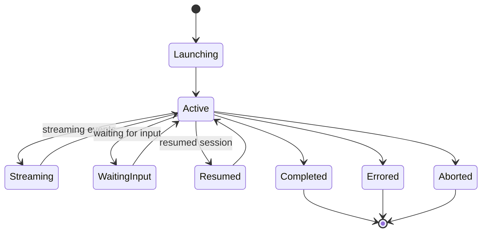

# Sessions

The session management layer provides a unified interface over Claude Code sessions, covering discovery of past sessions, launching new headless sessions, real-time streaming, resume and fork, and lifecycle tracking.

## Session Lifecycle

Sessions progress through a well-defined set of states:



The Session Manager maintains a `Map<string, ActiveSession>` for sessions launched by the middleware instance and emits these lifecycle events:

| Event | Description |
|-------|-------------|
| `session:started` | Session has been launched and is running |
| `session:completed` | Session finished successfully with a result |
| `session:errored` | Session encountered an error |
| `session:aborted` | Session was aborted via `AbortController` |

## Discovery

The discovery module wraps the Agent SDK's `listSessions()` to enumerate sessions across all projects or within a specific directory.

<CodeGroup>
```bash API
curl http://127.0.0.1:3000/api/v1/sessions?limit=20&offset=0
```

```bash CLI
ccm sessions list --limit 20 --project /path/to/project
```

```typescript SDK
import { discoverSessions } from "cc-middleware/sessions";

const sessions = await discoverSessions({ dir: "/path/to/project", limit: 20 });
```
</CodeGroup>

Each session includes metadata from Claude Code's `SDKSessionInfo`:

| Field | Description |
|-------|-------------|
| `sessionId` | Unique session identifier |
| `summary` | Auto-generated summary of the session |
| `lastModified` | Last modification timestamp |
| `customTitle` | User-assigned title (if renamed) |
| `firstPrompt` | The initial prompt that started the session |
| `gitBranch` | Git branch active when session was created |
| `cwd` | Working directory of the session |
| `tag` | User-assigned tag |
| `createdAt` | Creation timestamp |

## Session Storage

Claude Code stores sessions as JSONL files at:

```
~/.claude/projects/<encoded-cwd>/<session-id>.jsonl
```

Where `<encoded-cwd>` replaces non-alphanumeric characters with `-`. Each JSONL line is a transcript entry (user message, assistant message, tool use, tool result, or system event). The Agent SDK handles reading and writing these files.

The middleware adds a SQLite index on top of this storage for searchable metadata and full-text search.

## Launching Sessions

The launcher wraps the Agent SDK's `query()` function with several modes:

<Tabs>
  <Tab title="Single-Turn">
    Runs a prompt to completion and returns a `LaunchResult` with output, cost, session ID, and detailed usage metrics.

    ```typescript
    const result = await sessionManager.launch({
      prompt: "Analyze this codebase",
      maxTurns: 10,
      permissionMode: "plan",
    });

    // result.sessionId, result.result, result.costUsd, result.durationMs
    ```

    Launch options include:

    | Option | Description |
    |--------|-------------|
    | `prompt` | The prompt to send (required) |
    | `allowedTools` | Array of tool names to allow |
    | `disallowedTools` | Array of tool names to deny |
    | `permissionMode` | One of: `default`, `acceptEdits`, `plan`, `dontAsk`, `bypassPermissions`, `auto` |
    | `maxTurns` | Maximum number of turns |
    | `maxBudgetUsd` | Maximum cost budget |
    | `systemPrompt` | Custom system prompt |
    | `cwd` | Working directory |
    | `effort` | One of: `low`, `medium`, `high`, `max` |
    | `agent` | Name of a registered agent to use |
  </Tab>

  <Tab title="Streaming">
    Returns a `StreamingSession` with an async iterable of events. Events include text deltas, tool use start/end, tool progress, hook lifecycle, task notifications, rate limits, and more.

    ```typescript
    const session = await sessionManager.launchStreaming({
      prompt: "Explain this code",
    });

    for await (const event of session.events) {
      if (event.type === "text_delta") {
        process.stdout.write(event.text);
      }
    }

    const result = await session.result;
    ```

    <Warning>
      Streaming is incompatible with extended thinking (`maxThinkingTokens`) and structured output JSON streaming.
    </Warning>
  </Tab>

  <Tab title="Resume">
    Continue a previous session with a follow-up prompt. The agent has full context from the original session.

    ```typescript
    const result = await sessionManager.launch({
      prompt: "Now refactor the function we discussed",
      resume: "existing-session-id",
    });
    ```

    <Note>
      The SDK locates session files by working directory. If the session file is in a different `cwd` than the current one, the SDK will not find it.
    </Note>
  </Tab>

  <Tab title="Fork">
    Create a new session branching from an existing one, leaving the original unchanged.

    ```typescript
    const result = await sessionManager.launch({
      prompt: "Try an alternative approach",
      resume: "existing-session-id",
      forkSession: true,
    });
    ```
  </Tab>

  <Tab title="Continue">
    Resume the most recent session in the current directory without tracking a session ID.

    ```typescript
    const result = await sessionManager.launch({
      prompt: "Continue where we left off",
      continue: true,
    });
    ```
  </Tab>
</Tabs>

## Session Messages

Read the conversation history of any session:

<CodeGroup>
```bash API
curl http://127.0.0.1:3000/api/v1/sessions/{id}/messages?limit=50&offset=0
```

```bash CLI
ccm sessions show {id} --messages 50
```
</CodeGroup>

Each `SessionMessage` contains:

| Field | Type | Description |
|-------|------|-------------|
| `type` | `"user"` or `"assistant"` | Message role |
| `uuid` | `string` | Unique message identifier |
| `session_id` | `string` | Parent session ID |
| `message` | `unknown` | Raw payload from the transcript |

## Session Info & Updates

Individual session metadata can be read and updated:

<CodeGroup>
```bash Rename
curl -X PUT http://127.0.0.1:3000/api/v1/sessions/{id} \
  -H "Content-Type: application/json" \
  -d '{"title": "My Important Session"}'
```

```bash Tag
curl -X PUT http://127.0.0.1:3000/api/v1/sessions/{id} \
  -H "Content-Type: application/json" \
  -d '{"tag": "production"}'
```

```bash Clear Tag
curl -X PUT http://127.0.0.1:3000/api/v1/sessions/{id} \
  -H "Content-Type: application/json" \
  -d '{"tag": null}'
```
</CodeGroup>

## Aborting Sessions

Active sessions can be aborted via the API:

<CodeGroup>
```bash API
curl -X POST http://127.0.0.1:3000/api/v1/sessions/{id}/abort
```

```bash CLI
# Abort is triggered via the API; no direct CLI command yet
curl -X POST http://127.0.0.1:3000/api/v1/sessions/{id}/abort
```
</CodeGroup>

Abort uses the `AbortController` passed to `query()`. The session manager also provides `interrupt(sessionId)` for streaming input mode via `Query.interrupt()`.

## In-Memory Sessions

For ephemeral sessions that should not be persisted to disk:

```typescript
const result = await sessionManager.launch({
  prompt: "Quick calculation",
  persistSession: false,
});
// Session runs but no JSONL file is written
// Cannot be resumed later
```

## V1 vs V2 SDK

CC-Middleware builds on the **stable V1 `query()` API**. A V2 preview exists (`unstable_v2_createSession()`, `unstable_v2_resumeSession()`, `unstable_v2_prompt()`) with a session-based `send()`/`stream()` pattern. V2 is unstable and may change; the middleware tracks it but does not depend on it yet.
