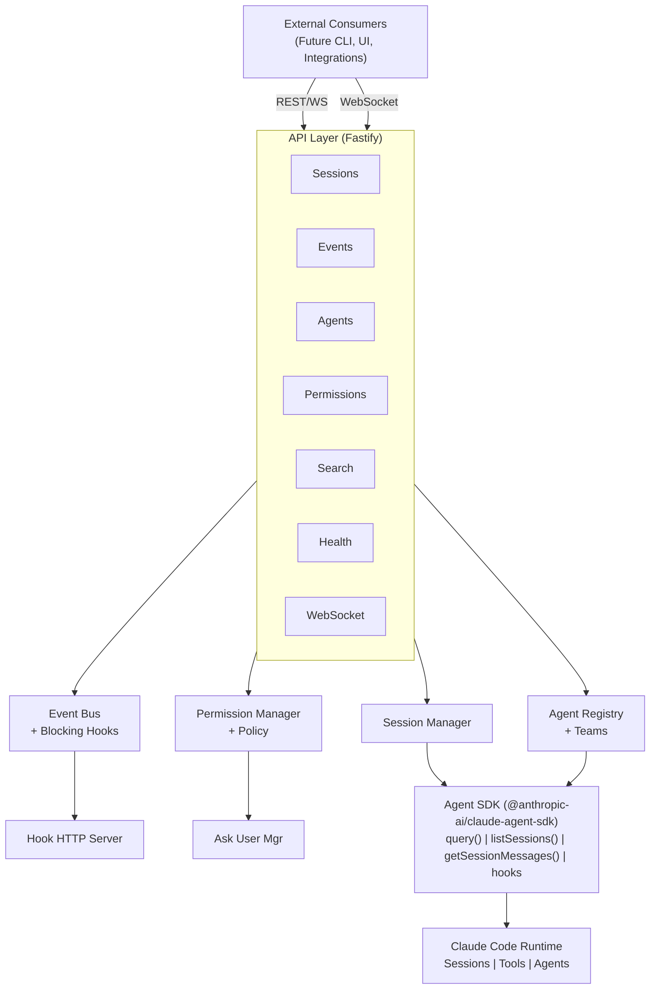
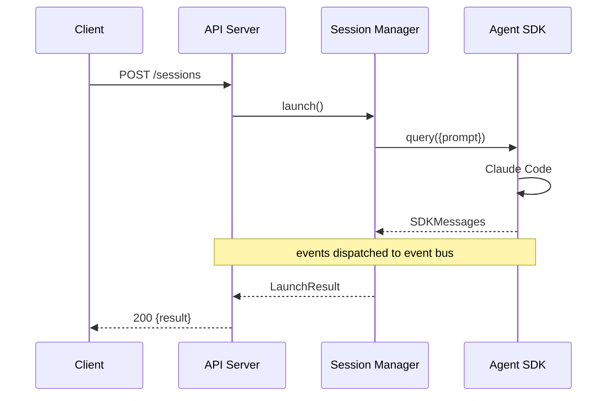
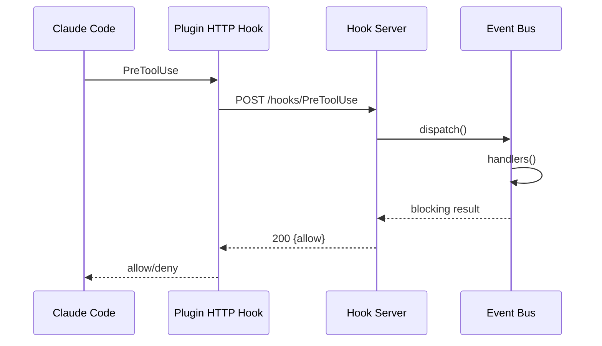
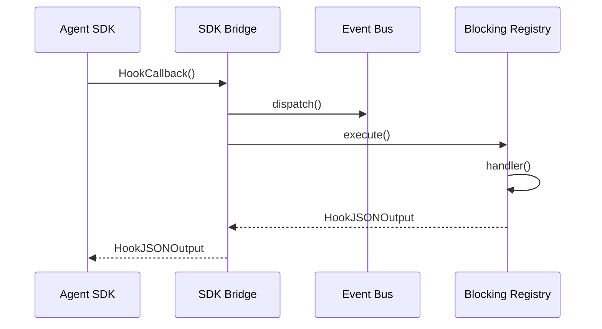

# CC-Middleware Architecture

## System Overview

CC-Middleware is a Node/TypeScript service that wraps Claude Code to provide a unified API for session management, hook events, permissions, and agent orchestration.

## Component Details

### Session Manager (`src/sessions/manager.ts`)
- [Session Management](session-management.md)
- Central coordinator for all session operations
- Tracks active sessions, handles launch/resume/abort
- Emits lifecycle events to the event bus

### Event System (`src/hooks/`)
- [Event System](event-system.md)
- Type-safe event bus for all Claude Code hook events
- Blocking hook stubs with replaceable handlers
- SDK hook bridge for programmatic sessions
- HTTP hook server for plugin-based sessions

### Permission System (`src/permissions/`)
- [Permission System](permission-system.md)
- Policy engine with allow/deny rules and glob patterns
- canUseTool implementation for Agent SDK
- AskUserQuestion handler with external resolution

### Agent System (`src/agents/`)
- [Agent System](agent-system.md)
- Reads agent definitions from filesystem
- Central registry with programmatic registration
- Team management and monitoring
- Programmatic agent launching

### API Layer (`src/api/`)
- [API Reference](../api/README.md)
- Fastify HTTP server with CORS
- REST endpoints for all middleware features
- WebSocket for real-time streaming and events

### Storage Layer (`src/store/`)
- SQLite session index with FTS5 search
- Session indexer (full and incremental)
- Search API with filters and highlights

### Plugin (`src/plugin/`)
- [Plugin Integration](plugin-integration.md)
- Claude Code plugin manifest
- HTTP hooks pointing to middleware server
- Skill for in-session middleware interaction

## Data Flow

### Launching a Headless Session

### Hook Event Flow (Plugin Mode)

### Hook Event Flow (SDK Mode)

## Configuration

### Environment Variables
| Variable | Default | Description |
|----------|---------|-------------|
| `CC_MIDDLEWARE_PORT` | `3000` | API server port |
| `CC_MIDDLEWARE_HOOK_PORT` | `3001` | Hook HTTP server port |
| `CC_MIDDLEWARE_HOST` | `127.0.0.1` | Bind address |
| `CC_MIDDLEWARE_DB_PATH` | `~/.cc-middleware/sessions.db` | SQLite database path |

### Integration Modes

**SDK Mode** (recommended): Launch sessions via the Agent SDK. Hooks are registered as TypeScript callbacks. Tightest integration, lowest latency.

**Plugin Mode**: Install as Claude Code plugin. Hooks are HTTP calls to the middleware server. Works with existing interactive Claude Code sessions.

**Hybrid**: Use both modes. SDK mode for programmatic sessions, plugin mode for interactive sessions. Both dispatch to the same event bus.
