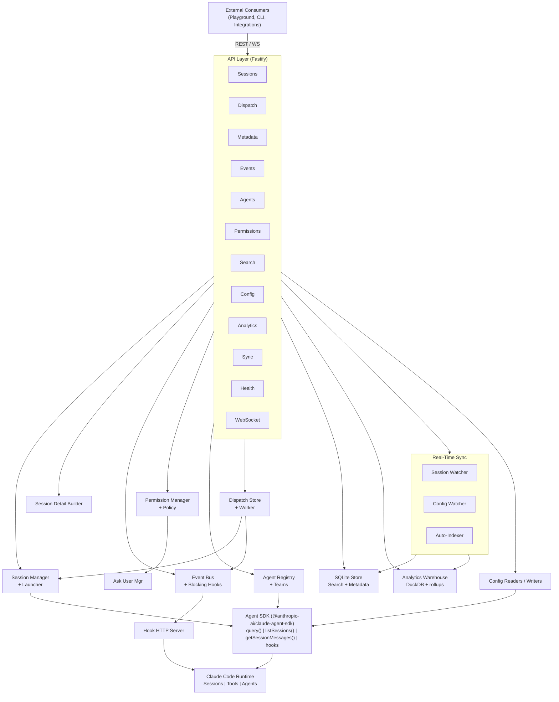
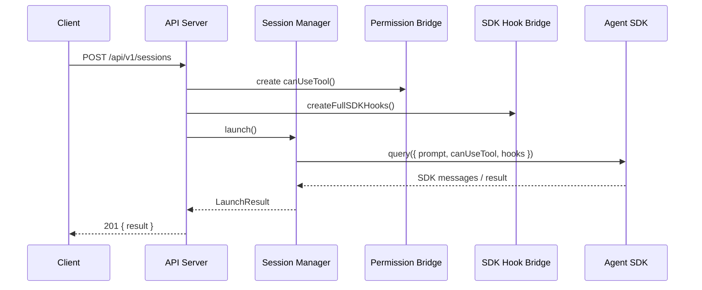
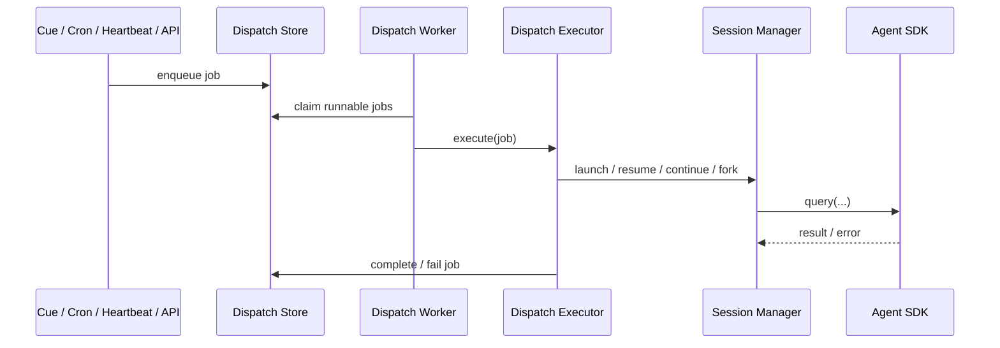
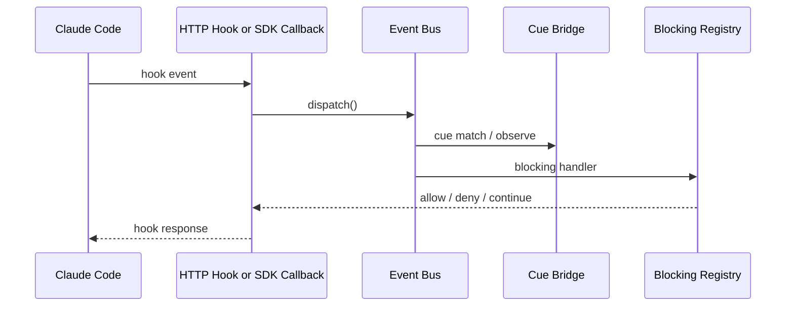

# CC-Middleware Architecture

## System Overview

CC-Middleware is a Node/TypeScript control plane over Claude Code. It exposes one API surface that combines session management, dispatch automation, hook events, permissions, metadata, analytics, configuration, and agent/team orchestration.

## Component Details

### Session Layer (`src/sessions/`)
- [Session Management](session-management.md)
- Discovers, launches, resumes, and aborts sessions
- Builds merged session catalogs and grouped directory views
- Builds a source-of-truth session detail projection directly from transcript files

### Dispatch Layer (`src/dispatch/`)
- [Dispatch System](dispatch-system.md)
- Durable queue for manual jobs, hook-triggered cues, cron schedules, and heartbeat rules
- Reuses the middleware launch path so queued work sees the same permission and hook bridges as API-owned sessions
- Serializes same-session work while allowing different sessions to run in parallel

### Event System (`src/hooks/`)
- [Event System](event-system.md)
- Type-safe event bus for Claude Code hook events plus middleware event broadcasting
- Blocking hook registry and SDK hook bridge
- HTTP hook server for plugin / interactive Claude Code sessions

### Permission System (`src/permissions/`)
- [Permission System](permission-system.md)
- Policy engine with allow/deny rules and glob patterns
- `canUseTool` implementation for Agent SDK launches
- AskUserQuestion handler with external resolution

### Agent System (`src/agents/`)
- [Agent System](agent-system.md)
- Reads agent definitions from filesystem
- Central registry with programmatic registration
- Team management and monitoring
- Programmatic agent launching

### API Layer (`src/api/`)
- [API Reference](../api/README.md)
- Fastify HTTP server with REST and WebSocket surfaces
- Registers sessions, analytics, dispatch, metadata, events, agents, permissions, search, and config routes from one shared context
- Pushes lifecycle, sync, hook, permission, and dispatch events over WebSocket

### Storage Layer (`src/store/`)
- SQLite operational catalog for session search, session metadata, and resource metadata
- Session indexer (full and incremental)
- Search API with lineage, team, and metadata filters

### Analytics Layer (`src/analytics/`)
- [Analytics System](analytics-system.md)
- Local DuckDB warehouse for transcript backfill and derived metrics
- Raw event ingestion from transcripts and middleware-launched sessions
- Derived facts for tools, errors, keywords, compactions, costs, and subagents
- Optional Claude Code OTel enrichment without depending on it for correctness

### Real-Time Sync (`src/sync/`)
- Session watcher, config watcher, and auto-indexer
- Broadcasts `session:*`, `config:*`, and `team:*` events over WebSocket
- Keeps SQLite search and DuckDB analytics fed from filesystem changes

### Config Layer (`src/config/`)
- Reads merged Claude settings, project/global config, runtime inventory, plugins, marketplaces, skills, MCP servers, memory, and `CLAUDE.md`
- Writes supported settings, plugin, marketplace, MCP, agent, and `CLAUDE.md` surfaces via the documented middleware API

### Plugin (`src/plugin/`)
- [Plugin Integration](plugin-integration.md)
- Claude Code plugin manifest
- HTTP hooks pointing to the middleware server
- Skill for in-session middleware interaction

## Data Flow

### Launching a Middleware-Owned Session

### Dispatch Materialization and Execution

### Hook Event Flow

## Configuration

### Environment Variables

| Variable | Default | Description |
|----------|---------|-------------|
| `CC_MIDDLEWARE_PORT` | `3000` | API server port |
| `CC_MIDDLEWARE_HOOK_PORT` | `3001` | Hook HTTP server port |
| `CC_MIDDLEWARE_HOST` | `127.0.0.1` | Bind address |
| `CC_MIDDLEWARE_DB_PATH` | `~/.cc-middleware/sessions.db` | SQLite operational database path |
| `CC_MIDDLEWARE_WATCH_SESSIONS` | `true` | Enable session file watching |
| `CC_MIDDLEWARE_WATCH_CONFIG` | `true` | Enable config file watching |
| `CC_MIDDLEWARE_AUTO_INDEX` | `true` | Enable auto-indexing of new or modified sessions |
| `CC_MIDDLEWARE_POLL_INTERVAL` | `10000` | Poll interval in ms for session watcher |
| `CC_MIDDLEWARE_DEBOUNCE_MS` | `2000` | Debounce interval in ms for file change events |

### Integration Modes

`SDK Mode`: Launch sessions via the Agent SDK. Hooks are registered as TypeScript callbacks.

`Plugin Mode`: Install as a Claude Code plugin. Hooks are HTTP calls to the middleware hook server.

`Hybrid`: Use both modes. SDK-owned sessions, interactive plugin hooks, queued dispatch work, and filesystem sync all converge on the same API/event surface.
