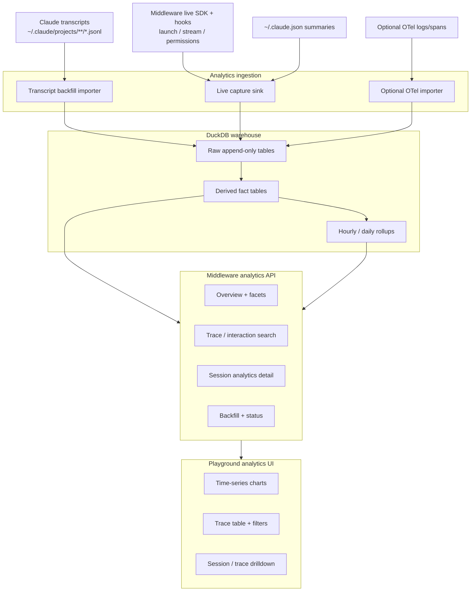

# Analytics & Developer Insights Architecture

## Overview

The analytics system adds a **local, queryable developer-insights layer** to CC-Middleware. It must support:

- Retroactive backfill from existing Claude Code session history
- Rich local analytics over prompts, tools, subagents, costs, errors, and derived keyword events
- Live capture for sessions launched through the middleware
- Optional enrichment from Claude Code OpenTelemetry without depending on it for correctness

The key design decision is:

> **Session transcripts are the primary source of truth.**

Claude Code OpenTelemetry is useful for forward-looking enrichment, but it is not the foundation because it is opt-in, runtime-only, and not suitable as the sole backfill path.

## Why Transcript-First

The existing session store and index already prove that Claude Code transcript files are stable and readable:

- [../../src/sessions/transcripts.ts](../../src/sessions/transcripts.ts)
- [../../src/sessions/messages.ts](../../src/sessions/messages.ts)
- [../../src/store/indexer.ts](../../src/store/indexer.ts)

Local transcript research found that the raw JSONL history already includes:

- Root and subagent transcripts
- User prompts and assistant responses
- Tool uses and tool results
- `usage` payloads with input/output/cache token counts
- API-error assistant messages
- `compact_boundary` system messages
- `turn_duration` system messages
- Queue operations
- Permission mode changes
- Agent names and sidechain lineage

That is enough to build a high-value analytics warehouse even without OpenTelemetry.

## Existing Code Seams

| Area | Existing files | Why it matters |
|------|----------------|----------------|
| Transcript discovery | [../../src/sessions/transcripts.ts](../../src/sessions/transcripts.ts), [../../src/sessions/messages.ts](../../src/sessions/messages.ts) | Current implementation is good for previews, but too lossy for analytics. We need raw ingestion. |
| Session launch | [../../src/sessions/launcher.ts](../../src/sessions/launcher.ts), [../../src/sessions/streaming.ts](../../src/sessions/streaming.ts), [../../src/sessions/utils.ts](../../src/sessions/utils.ts) | These are the right places to persist raw SDK messages for live analytics. |
| Hook bridge | [../../src/hooks/sdk-bridge.ts](../../src/hooks/sdk-bridge.ts) | Hook events should become analytics facts and live audit data. |
| Permissions | [../../src/permissions/handler.ts](../../src/permissions/handler.ts) | Permission events need real `session_id` and `cwd` to join correctly. |
| API routes | [../../src/api/server.ts](../../src/api/server.ts), [../../src/api/routes/sessions.ts](../../src/api/routes/sessions.ts), [../../src/api/websocket.ts](../../src/api/websocket.ts) | Launch routes need analytics plumbing and a future analytics API module. |
| Existing store | [../../src/store/db.ts](../../src/store/db.ts), [../../src/store/search.ts](../../src/store/search.ts) | SQLite remains the operational catalog/search layer, but not the analytics warehouse. |
| Project metrics | [../../src/config/global.ts](../../src/config/global.ts) | `~/.claude.json` already exposes useful per-project summary metrics for reconciliation. |
| Plugin hooks | [../../src/plugin/hooks/hooks.json](../../src/plugin/hooks/hooks.json) | Plugin hook coverage must be widened for interactive-session analytics. |
| Playground shell | [../../playground/src/lib/playground.ts](../../playground/src/lib/playground.ts), [../../playground/src/components/playground-ui.tsx](../../playground/src/components/playground-ui.tsx) | These are the entry points for an analytics view. |

## Data Sources

| Source | Path / docs | Backfill? | Primary use |
|--------|-------------|-----------|-------------|
| Claude Code root transcripts | `~/.claude/projects/<encoded-cwd>/<session-id>.jsonl` | Yes | Source of truth for prompts, responses, usage, compaction, errors |
| Claude Code sidechain transcripts | `~/.claude/projects/<encoded-cwd>/<session-id>/subagents/*.jsonl` | Yes | Subagent lineage, sidechain tool work, agent detail |
| Middleware raw SDK messages | Live `query()` output from [../../src/sessions/launcher.ts](../../src/sessions/launcher.ts) and [../../src/sessions/streaming.ts](../../src/sessions/streaming.ts) | No | Higher-fidelity live capture for middleware-launched sessions |
| Middleware hook and permission events | [../../src/hooks/sdk-bridge.ts](../../src/hooks/sdk-bridge.ts), [../../src/permissions/handler.ts](../../src/permissions/handler.ts) | No | Permission decisions, denials, hook timing, policy audit |
| Project summary metrics | `~/.claude.json` via [../../src/config/global.ts](../../src/config/global.ts) | Partially | Reconciliation and project-level metric summaries |
| Claude Code OpenTelemetry | [Monitoring docs](https://code.claude.com/docs/en/monitoring-usage) | No | Optional live enrichment: `prompt.id`, spans, tool details, estimated request cost |
| Internal telemetry spill files | `~/.claude/telemetry/*.json` | Maybe | Supplemental forensics only, not guaranteed complete |

## Storage Model

### Operational Store

Keep the existing SQLite store for:

- Session catalog
- Search and metadata
- Fast operational lookups

Relevant files:

- [../../src/store/db.ts](../../src/store/db.ts)
- [../../src/store/indexer.ts](../../src/store/indexer.ts)
- [../../src/store/search.ts](../../src/store/search.ts)

### Analytics Warehouse

Add a separate local DuckDB database at:

```text
~/.cc-middleware/analytics.duckdb
```

Recommended Node client: [`@duckdb/node-api`](https://duckdb.org/docs/1.3/clients/node_neo/overview.html).

DuckDB is a better fit than SQLite for:

- Time-series rollups
- Wide analytical scans
- Faceting and slice/dice queries
- Materialized-style derived tables
- Local columnar analytics over large JSONL history

## Proposed Architecture



## Warehouse Layers

### Raw Tables

These tables should be append-only and re-derivable:

- `raw_transcript_events`
- `raw_middleware_sdk_messages`
- `raw_hook_events`
- `raw_permission_events`
- `raw_otel_logs`
- `raw_otel_spans`

Each row should keep:

- Source path or source channel
- Timestamp
- Session ID when known
- Event/message type
- JSON payload
- Stable dedupe key

### Dimensions

- `dim_sessions`
- `dim_projects`
- `dim_agents`
- `dim_models`
- `dim_keyword_terms`

### Fact Tables

- `fact_interactions`
- `fact_requests`
- `fact_tool_calls`
- `fact_errors`
- `fact_subagent_runs`
- `fact_compactions`
- `fact_keyword_mentions`
- `fact_permission_decisions`

### Rollups

- `rollup_metrics_hourly`
- `rollup_metrics_daily`
- `rollup_keyword_hourly`
- `rollup_error_hourly`
- `rollup_tool_hourly`

## Synthetic Trace Model

The user asked for trace search, but transcripts do not contain native distributed-tracing IDs for historical sessions. The system therefore needs a **synthetic interaction trace** model:

1. A root `user` message starts an interaction.
2. Following assistant/tool/system events belong to that interaction until the next root `user` message.
3. Tool calls are linked through tool-use IDs and transcript ordering.
4. Subagent transcripts join back through `sourceToolAssistantUUID`, sidechain paths, `agentId`, and `slug`.
5. If live OTel is present, store `otel_trace_id` and `prompt.id` as optional join fields, but do not require them.

This gives us a practical local `trace_id` / `interaction_id` for search and drilldown without relying on external telemetry.

## Metric Derivation

### Keyword Analytics

V1 should use deterministic English dictionaries and regex rules, not model classification.

Categories:

- `frustration`
- `cursing`
- `insult`
- `aggression`
- `urgency`

Store:

- matched term
- category
- speaker (`user`, later optionally `assistant`)
- session ID
- interaction ID
- timestamp
- count

### Errors

Capture at least:

- API errors from transcript assistant/system records
- Tool-result errors (`tool_result.is_error`)
- Permission denials
- Middleware execution errors
- Subagent failures

### Cost and Tokens

Historical transcripts already provide strong token data through assistant `usage` payloads:

- `input_tokens`
- `output_tokens`
- `cache_read_input_tokens`
- `cache_creation_input_tokens`

Historical cost should therefore be derived from:

```text
estimated_cost_usd = pricing(model, token_usage_at_request_time)
```

Live SDK results and OTel can be used as reconciliation inputs, but not as the sole store.

### Context Window Metric

For historical sessions, the best local metric is:

```text
request_context_tokens_est =
  input_tokens + cache_read_input_tokens + cache_creation_input_tokens
```

This is not the exact internal model context size, but it is a strong developer-facing approximation for:

- growth over time
- large-turn spikes
- drops after compaction

`compact_boundary` should be treated as the annotation/reset signal.

## Metric Semantics

The analytics surface intentionally mixes exact and derived signals. The important contract is to label them clearly:

- Exact historical:
  - transcript event counts
  - tool uses and tool-result failures present in transcripts
  - request token usage stored in transcript `usage`
  - compaction boundaries and turn-duration events present in history
- Estimated historical:
  - `estimated_cost_usd` derived from local model pricing tables
  - `request_context_tokens_est` derived from request token usage
- Live-only or optional enrichment:
  - native OTel trace/span identifiers
  - prompt/tool-detail telemetry that depends on runtime monitoring settings
  - middleware-only hook and permission timing details

That split should stay visible in the API and UI so developers know which values are exact facts versus best-effort local estimates.

## Operator Guide

The normal local workflow is:

1. Start the middleware so DuckDB is available.
2. Run transcript backfill through `POST /api/v1/analytics/backfill` with no OTel flags for the baseline historical warehouse.
3. Re-run with `includeOtel: true` only if you want optional enrichment from local telemetry files.
4. Leave `includeSensitiveOtelPayload` at `false` unless you intentionally want raw telemetry content stored for debugging.

Recommended examples:

- Transcript-only backfill:

```json
{
  "projectsRoot": "~/.claude/projects"
}
```

- Transcript plus optional telemetry enrichment:

```json
{
  "projectsRoot": "~/.claude/projects",
  "includeOtel": true,
  "otelRoot": "~/.claude/telemetry",
  "includeSensitiveOtelPayload": false
}
```

The warehouse still works fully without telemetry files. OTel is enrichment only.

## Live Capture Requirements

The live path must be hardened so analytics does not miss middleware-launched sessions.

Required fixes:

1. Route launch/resume requests must pass analytics plumbing into the session manager:
   - [../../src/api/routes/sessions.ts](../../src/api/routes/sessions.ts)
   - [../../src/api/websocket.ts](../../src/api/websocket.ts)
2. Middleware launch paths must persist raw SDK messages:
   - [../../src/sessions/launcher.ts](../../src/sessions/launcher.ts)
   - [../../src/sessions/streaming.ts](../../src/sessions/streaming.ts)
3. Permission events need real join keys:
   - [../../src/permissions/handler.ts](../../src/permissions/handler.ts)
4. Plugin hooks need broader coverage for interactive sessions:
   - [../../src/plugin/hooks/hooks.json](../../src/plugin/hooks/hooks.json)

## Privacy and Safety Controls

The analytics system should be built with explicit privacy controls:

- Keyword matching should default to user prompts only
- Assistant text analysis should be opt-in
- Tool input/output content should be opt-in
- Sensitive raw content should remain in raw tables only when explicitly enabled
- Derived fact tables should prefer hashed, categorized, or truncated values where possible

## Developer Surfaces

### API

Planned route family:

- `/api/v1/analytics/status`
- `/api/v1/analytics/overview`
- `/api/v1/analytics/timeseries`
- `/api/v1/analytics/traces`
- `/api/v1/analytics/traces/:id`
- `/api/v1/analytics/sessions/:id`
- `/api/v1/analytics/facets`
- `/api/v1/analytics/backfill`

### Playground

The playground should add an analytics page with:

- synchronized time-series charts
- brush-based time slicing
- faceted filters
- trace table
- session / interaction drilldown drawer

Existing UI entry points:

- [../../playground/src/lib/playground.ts](../../playground/src/lib/playground.ts)
- [../../playground/src/components/playground-ui.tsx](../../playground/src/components/playground-ui.tsx)
- [../../playground/src/pages/overview-page.tsx](../../playground/src/pages/overview-page.tsx)

## Related Docs

- [README.md](README.md)
- [session-management.md](session-management.md)
- [event-system.md](event-system.md)
- [permission-system.md](permission-system.md)
- [../plan/phases/13-analytics-observability.md](../plan/phases/13-analytics-observability.md)
- [../research/analytics-sources.md](../research/analytics-sources.md)

## External References

- [Claude Code monitoring / OpenTelemetry](https://code.claude.com/docs/en/monitoring-usage)
- [Claude Code hooks reference](https://code.claude.com/docs/en/hooks)
- [Claude Code CLI reference](https://code.claude.com/docs/en/cli-reference)
- [Agent SDK TypeScript reference](https://platform.claude.com/docs/en/agent-sdk/typescript)
- [How the agent loop works](https://platform.claude.com/docs/en/agent-sdk/agent-loop)
- [Agent Skills in the SDK](https://platform.claude.com/docs/en/agent-sdk/skills)
- [Usage and Cost API](https://platform.claude.com/docs/en/build-with-claude/usage-cost-api)
- [Claude Code Analytics API](https://platform.claude.com/docs/en/build-with-claude/claude-code-analytics-api)
- [DuckDB Node client](https://duckdb.org/docs/1.3/clients/node_neo/overview.html)
- [DuckDB SQLite extension](https://duckdb.org/docs/current/core_extensions/sqlite)
- [DuckDB full-text search](https://duckdb.org/docs/current/core_extensions/full_text_search)
- [shadcn/ui chart](https://ui.shadcn.com/docs/components/base/chart)
