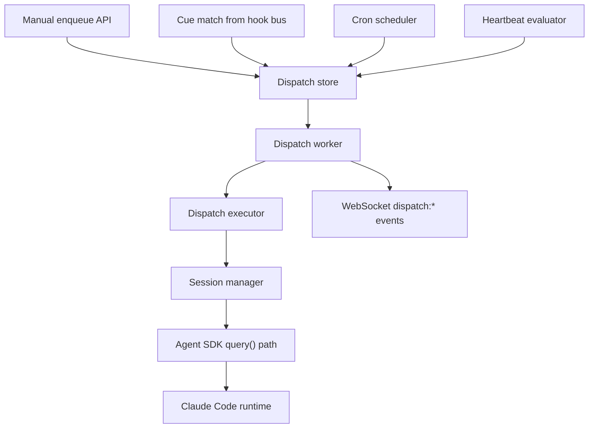

# Dispatch System Architecture

## Overview

The dispatch subsystem adds durable automation on top of the middleware’s normal session-launch path. It exists so the middleware can:

- enqueue manual work for later execution
- react to Claude Code hook events with queued follow-on work
- run scheduled prompts on cron-like intervals
- run heartbeat checks against middleware/runtime state

The key design rule is:

> **All dispatched work should execute through the same middleware launch plumbing as normal API-owned sessions.**

That keeps permissions, hooks, analytics, session tracking, and agent selection consistent across manual launches and automated work.

## Core Concepts

### Dispatch Job

A durable unit of queued work. Jobs capture:

- `sourceType`: `manual`, `cue`, `cron`, `heartbeat`
- `targetType`: `new_session`, `resume_session`, `continue_session`, `fork_session`, `agent`
- `runtimeProfile`: `claude_runtime`, `isolated_sdk`
- prompt, cwd, sessionId, agent, variables, payload
- retry, lease, priority, dedupe, and concurrency controls

### Dispatch Run

One execution attempt for a job. Runs preserve attempt history without mutating the meaning of the job itself.

### Cue

A persistent rule that listens to hook events and materializes jobs when a match occurs. Cues are the bridge between the event system and the durable queue.

### Schedule

A cron-backed rule that materializes jobs at computed run times. Schedules do not bypass the queue; they create the same job shape as a manual enqueue.

### Heartbeat Rule

A synthetic periodic rule driven by middleware/runtime health state rather than Claude Code hook callbacks.

## Components

### Types (`src/dispatch/types.ts`)

Shared TypeScript contracts for jobs, runs, cues, schedules, heartbeat rules, summaries, and filter options.

### Store (`src/dispatch/store.ts`)

SQLite-backed durable state for:

- jobs
- runs
- cue definitions
- schedule definitions
- heartbeat rule definitions

The store also owns:

- lease / claim semantics
- retry bookkeeping
- dedupe and concurrency keys
- queue summary counts

### Executor (`src/dispatch/executor.ts`)

Turns a dispatch job into a real middleware launch or resume operation. The executor is responsible for:

- choosing the correct session-manager method
- forwarding main-thread `agent`
- wiring `canUseTool`
- wiring `createFullSDKHooks(...)`
- preserving analytics / launch metadata

### Worker (`src/dispatch/worker.ts`)

Background queue consumer that:

- claims runnable jobs
- executes them through the executor
- marks runs/jobs completed or failed
- respects leases and concurrency semantics

### Cue Bridge (`src/dispatch/cues.ts`)

Listens to the hook event bus, matches cue triggers, and materializes jobs.

### Scheduler (`src/dispatch/scheduler.ts`)

Computes cron run times, scans schedules, and materializes due jobs.

### Heartbeat (`src/dispatch/heartbeat.ts`)

Evaluates heartbeat rules against middleware/runtime state and materializes jobs when conditions are met.

## Why It Lives Here

The middleware already centralizes:

- session launching and resuming
- hook observation and blocking decisions
- permission control
- runtime/config inspection
- WebSocket fan-out

Dispatch belongs in the middleware because it needs all of those capabilities at once. A separate runner would quickly drift and lose visibility into hooks, permissions, and current runtime state.

## Execution Flow

## Hook Integration

Cue rules are driven by the middleware event bus, which can receive events from:

- SDK hook callbacks for middleware-owned launches
- the HTTP hook server for plugin / interactive Claude Code sessions

That means “dispatch on hook” works across both programmatic and plugin-mode sessions, subject to the actual hook surface provided by each source.

Important distinction:

- the HTTP hook path covers the broader Claude Code hook system
- the SDK hook callback path is narrower and reflects the Agent SDK’s supported hook callbacks

## Multi-Session Concurrency

The dispatch system must handle multiple sessions safely.

Current rule:

- jobs for different sessions may run in parallel
- jobs targeting the same session must not overlap

That policy is enforced by the store claim/update path through stable `concurrencyKey` handling, not by ad hoc worker behavior. For `resume_session` and `fork_session` jobs, the default concurrency key is derived from `sessionId`.

This lets the worker stay parallel without risking two overlapping resumes against the same session transcript.

## Runtime Profiles

### `claude_runtime`

Uses the middleware’s Claude-runtime-aware launch behavior, including the same permission and hook wiring expected by API-owned sessions.

### `isolated_sdk`

Reserved for more isolated SDK execution where callers explicitly want a thinner runtime surface. Even here, the middleware still routes execution through the shared executor.

## WebSocket Events

The dispatch subsystem emits:

- `dispatch:job-created`
- `dispatch:job-started`
- `dispatch:job-completed`
- `dispatch:job-failed`
- `dispatch:cue-triggered`
- `dispatch:heartbeat`

These make the queue observable from the playground and any other live operations surface.

## Current Limits

- The queue semantics are designed and verified for the current single-process middleware runtime.
- Cron support is intentionally small and focused.
- Heartbeat rules are synthetic middleware triggers, not Claude Code hook types.

If the system later grows into multi-process or distributed operation, the main hardening seam will be store/lease coordination, not the executor interface.
