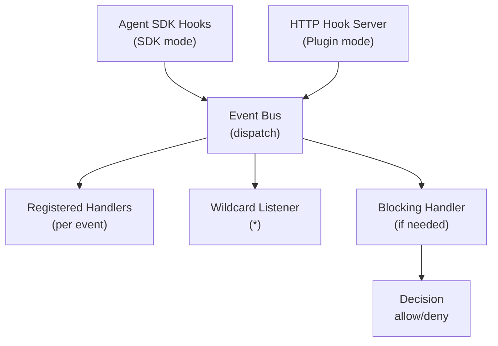

# Event System Architecture

## Overview

The event system dispatches Claude Code lifecycle events through a typed event bus, with blocking hook support, SDK integration, and an HTTP hook server for plugin mode.

## Components

### Event Bus (`src/hooks/event-bus.ts`)
Typed `EventEmitter` (via `eventemitter3`) that supports all Claude Code hook event types plus a wildcard `*` listener.

**Supported events**: PreToolUse, PostToolUse, PostToolUseFailure, SessionStart, SessionEnd, UserPromptSubmit, Stop, StopFailure, SubagentStart, SubagentStop, TaskCreated, TaskCompleted, TeammateIdle, PermissionRequest, PermissionDenied, Notification, ConfigChange, CwdChanged, FileChanged, WorktreeCreate, WorktreeRemove, PreCompact, PostCompact, Elicitation, ElicitationResult.

### Blocking Hooks (`src/hooks/blocking.ts`)
Registry of handlers for blocking events (events that can prevent an action).

**Default behavior**: All blocking events have stub handlers that return a positive (allow) response. This means the middleware is transparent by default - it doesn't interfere with Claude Code operations.

**Customization**: Consumers register custom handlers that override the stubs. A handler returns allow/deny decisions that flow back to Claude Code.

**Matcher support**: For tool events (PreToolUse, PostToolUse), handlers can specify a regex matcher on tool name. Multiple handlers with different matchers can coexist.

### SDK Bridge (`src/hooks/sdk-bridge.ts`)
Converts middleware event registrations into Agent SDK `hooks` option format.

When launching sessions via `query()`, the bridge generates `HookCallbackMatcher[]` entries that:
1. Dispatch events to the event bus (for observability)
2. Execute blocking handlers (for control)
3. Return `HookJSONOutput` to the SDK

### HTTP Hook Server (`src/hooks/server.ts`)
HTTP server that receives hook events from Claude Code's HTTP hook system.

Used in **plugin mode** where Claude Code sends HTTP POST requests for each hook event. The server:
1. Parses the hook input JSON from the request body
2. Dispatches to the event bus
3. For blocking events, executes the blocking handler
4. Returns the result as HTTP response

**Port**: Configurable, default 3001 (separate from the main API port).

## Event Flow Diagram



## Hook Input/Output Contracts

All hook inputs extend a base shape:
```typescript
{
  session_id: string;
  transcript_path: string;
  cwd: string;
  permission_mode?: string;
  hook_event_name: string;
  agent_id?: string;
  agent_type?: string;
}
```

Blocking hook outputs follow the `HookJSONOutput` format from the Agent SDK:

**All hooks return `HookJSONOutput`** (or `{}` to proceed with no changes):
```typescript
{
  systemMessage?: string;              // Inject message visible to model
  continue?: boolean;                  // Control if agent keeps running
  decision?: "approve" | "block";      // For Stop/TaskCompleted/TeammateIdle
  reason?: string;                     // Explanation for decision
  hookSpecificOutput?: {
    hookEventName: string;             // REQUIRED - must match event type
    // ... event-specific fields
  }
}
```

**Per-event blocking format:**
- **PreToolUse**: `{ hookSpecificOutput: { hookEventName: "PreToolUse", permissionDecision: "deny", permissionDecisionReason: "..." } }`
- **PermissionRequest**: `{ hookSpecificOutput: { hookEventName: "PermissionRequest", decision: { behavior: "deny" } } }`
- **Stop**: `{ decision: "block", reason: "..." }` (block = continue conversation)
- **TaskCompleted/TeammateIdle**: `{ decision: "block", reason: "..." }`
- **Default (all events)**: `{}` = proceed with no changes

**Important**: `HookJSONOutput` (hook callbacks) is a DIFFERENT type from `PermissionResult` (canUseTool callback). Don't confuse them:
- Hook callbacks → `HookJSONOutput` (`{}` or `{ hookSpecificOutput: ... }`)
- `canUseTool` → `PermissionResult` (`{ behavior: "allow" }` or `{ behavior: "deny", message: "..." }`)

## Real-Time Sync Events (Phase 12)

In addition to the hook event system above, the real-time sync subsystem emits its own events through the WebSocket broadcaster. These events are generated by the session watcher and config watcher, not by Claude Code hooks.

### Session Sync Events
| Event Type | Trigger | Payload |
|------------|---------|---------|
| `session:discovered` | New `.jsonl` file appears in `~/.claude/projects/` | `{ sessionId, timestamp }` |
| `session:updated` | Existing session file is modified | `{ sessionId, timestamp }` |
| `session:removed` | Session file is deleted | `{ sessionId, timestamp }` |

### Config Sync Events
| Event Type | Trigger | Payload |
|------------|---------|---------|
| `config:changed` | Settings file modified (`settings.json`, `settings.local.json`) | `{ scope, path, timestamp }` |
| `config:mcp-changed` | MCP config file modified (`.claude.json`, `.mcp.json`) | `{ path, timestamp }` |
| `config:agent-changed` | Agent definition `.md` file created/modified/removed | `{ name, action, timestamp }` |
| `config:skill-changed` | Skill `SKILL.md` file created/modified/removed | `{ name, action, timestamp }` |
| `config:rule-changed` | Rule `.md` file created/modified/removed | `{ name, action, timestamp }` |
| `config:plugin-changed` | `installed_plugins.json` modified | `{ path, timestamp }` |
| `config:memory-changed` | Memory file modified | `{ path, timestamp }` |
| `team:created` | New team config directory created | `{ teamName, timestamp }` |
| `team:updated` | Team `config.json` modified | `{ teamName, timestamp }` |
| `team:task-updated` | Task file in `~/.claude/tasks/` modified | `{ path, timestamp }` |

### Subscribing to Sync Events

WebSocket clients subscribe to sync events using the same pattern-based subscription system as hook events:

```json
{ "type": "subscribe", "events": ["session:*"] }
{ "type": "subscribe", "events": ["config:*"] }
{ "type": "subscribe", "events": ["team:*"] }
{ "type": "subscribe", "events": ["*"] }
```

The wildcard `session:*` matches all three session sync events (`session:discovered`, `session:updated`, `session:removed`) as well as the existing session lifecycle events (`session:started`, `session:completed`, `session:errored`, `session:aborted`).
