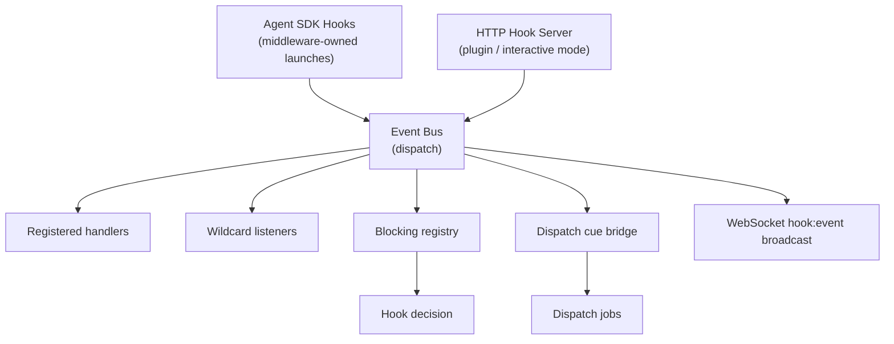

# Event System Architecture

## Overview

The event system is the middleware’s hook and event backbone. It dispatches Claude Code lifecycle events through a typed event bus, supports blocking decisions where Claude allows them, and feeds downstream consumers such as the dispatch cue bridge and WebSocket broadcaster.

## Components

### Event Bus (`src/hooks/event-bus.ts`)

Typed `EventEmitter` (via `eventemitter3`) that supports all middleware-recognized Claude Code hook events plus a wildcard `*` listener.

**Supported events** currently include:

- `PreToolUse`
- `PostToolUse`
- `PostToolUseFailure`
- `SessionStart`
- `SessionEnd`
- `InstructionsLoaded`
- `UserPromptSubmit`
- `Stop`
- `StopFailure`
- `SubagentStart`
- `SubagentStop`
- `TaskCreated`
- `TaskCompleted`
- `TeammateIdle`
- `PermissionRequest`
- `PermissionDenied`
- `Notification`
- `ConfigChange`
- `CwdChanged`
- `FileChanged`
- `WorktreeCreate`
- `WorktreeRemove`
- `PreCompact`
- `PostCompact`
- `Elicitation`
- `ElicitationResult`
- `Setup`

### Blocking Hooks (`src/hooks/blocking.ts`)

Registry of handlers for blocking-capable events.

Default behavior:

- the middleware is transparent by default
- stub handlers return a pass-through result
- consumers opt in to intervention by registering custom handlers

Matcher support allows tool-specific handlers for events such as `PreToolUse`.

### SDK Bridge (`src/hooks/sdk-bridge.ts`)

Converts middleware handler registrations into Agent SDK `hooks` callbacks.

For middleware-owned launches, the bridge:

1. dispatches the event to the bus
2. runs blocking handlers when relevant
3. returns `HookJSONOutput` back to the SDK

Important constraint:

- the SDK callback surface is narrower than the full Claude Code HTTP hook surface

That is why the middleware keeps both the SDK bridge and the HTTP hook server.

### HTTP Hook Server (`src/hooks/server.ts`)

Receives Claude Code HTTP hook requests in plugin / interactive mode.

The server:

1. parses the incoming hook input
2. dispatches it to the event bus
3. executes blocking handlers when relevant
4. returns the hook decision in the expected JSON format

Because Claude Code treats hook-body JSON as the real decision channel, the HTTP response status remains `200` even when the effective decision is “deny” or “block”.

### Cue Bridge (`src/dispatch/cues.ts`)

The dispatch subsystem consumes the event bus through cue rules. That means hook events are not just observable; they can materialize queued work for later execution.

## Event Flow Diagram



## Hook Input/Output Contracts

All hook inputs extend a shared base shape:

```typescript
{
  session_id: string;
  transcript_path: string;
  cwd: string;
  permission_mode?: string;
  hook_event_name: string;
  agent_id?: string;
  agent_type?: string;
}
```

Blocking hook outputs follow the Agent SDK `HookJSONOutput` shape.

```typescript
{
  systemMessage?: string;
  continue?: boolean;
  decision?: "approve" | "block";
  reason?: string;
  hookSpecificOutput?: {
    hookEventName: string;
  };
}
```

Important distinctions:

- Hook callbacks return `HookJSONOutput`
- `canUseTool` returns `PermissionResult`
- `{}` means “proceed with no hook-side change”

Examples:

- `PreToolUse`: return `hookSpecificOutput.permissionDecision`
- `PermissionRequest`: return `hookSpecificOutput.decision`
- `Stop` / `TaskCompleted` / `TeammateIdle`: use top-level `decision: "block"`

## Dispatch Integration

Hook events now drive more than observability.

- cue rules listen for matching hook events and enqueue jobs
- SDK-owned sessions and plugin-owned sessions can both trigger cues
- dispatch lifecycle is broadcast separately as `dispatch:*` WebSocket events

This is the main reason hook parity matters: if an event is missing from the event bus type surface, it cannot participate cleanly in cue routing.

## Real-Time Sync Events

In addition to Claude Code hook events, the middleware emits filesystem-driven sync events through the WebSocket broadcaster.

### Session Sync Events

| Event Type | Trigger | Payload |
|------------|---------|---------|
| `session:discovered` | New `.jsonl` file appears in `~/.claude/projects/` | `{ sessionId, timestamp }` |
| `session:updated` | Existing session file is modified | `{ sessionId, timestamp }` |
| `session:removed` | Session file is deleted | `{ sessionId, timestamp }` |

### Config Sync Events

| Event Type | Trigger | Payload |
|------------|---------|---------|
| `config:changed` | Settings file modified | `{ scope, path, timestamp }` |
| `config:mcp-changed` | MCP config file modified | `{ path, timestamp }` |
| `config:agent-changed` | Agent definition changed | `{ name, action, timestamp }` |
| `config:skill-changed` | Skill changed | `{ name, action, timestamp }` |
| `config:rule-changed` | Rule changed | `{ name, action, timestamp }` |
| `config:plugin-changed` | Installed plugin registry changed | `{ path, timestamp }` |
| `config:memory-changed` | Memory file changed | `{ path, timestamp }` |
| `team:created` | Team directory created | `{ teamName, timestamp }` |
| `team:updated` | Team config changed | `{ teamName, timestamp }` |
| `team:task-updated` | Team task file changed | `{ path, timestamp }` |

## WebSocket Subscription Patterns

Clients subscribe to event families with the same pattern system used elsewhere:

```json
{ "type": "subscribe", "events": ["hook:*"] }
{ "type": "subscribe", "events": ["session:*"] }
{ "type": "subscribe", "events": ["config:*"] }
{ "type": "subscribe", "events": ["dispatch:*"] }
{ "type": "subscribe", "events": ["*"] }
```

This lets operator UIs combine hook, sync, lifecycle, and dispatch activity on one live feed without polling.
