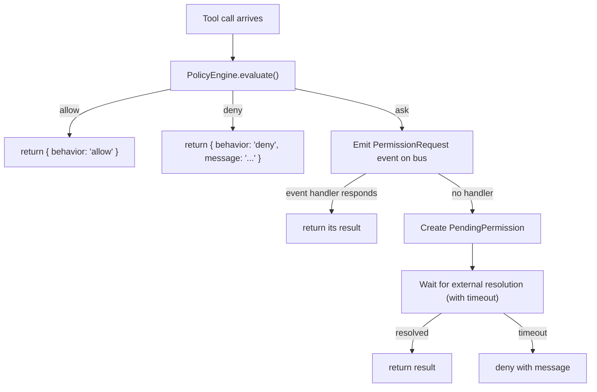

# Permission System Architecture

## Overview

The permission system provides programmatic control over tool approvals and user question handling. It implements the Agent SDK's `canUseTool` callback with a policy engine, event-based approval, and external resolution support.

## Components

### Policy Engine (`src/permissions/policy.ts`)
Rule-based evaluation engine for tool permission decisions.

**Rules** are evaluated in priority order (lower priority number = higher precedence):
```typescript
{
  id: "allow-read",
  toolName: "Read",        // Regex pattern
  behavior: "allow",
  priority: 1
}
```

**Bash condition syntax**: For Bash tool, conditions can specify command patterns:
```typescript
{
  toolName: "Bash",
  behavior: "deny",
  condition: "Bash(rm *)",  // Deny rm commands
  priority: 1
}
```

**Evaluation**:
1. Check rules in priority order
2. First matching rule wins
3. If no rule matches, use `defaultBehavior` (allow/deny/ask)

### Permission Handler (`src/permissions/handler.ts`)
Implements `canUseTool` callback for the Agent SDK.

**Flow**:


### Permission Manager
Tracks pending permissions for external resolution (e.g., from a UI).

- `getPendingPermissions()` - List awaiting decisions
- `resolvePermission(id, result)` - Approve or deny
- `denyAllPending(message)` - Bulk deny on shutdown

### AskUserQuestion Manager (`src/permissions/ask-user.ts`)
Handles Claude's AskUserQuestion tool calls.

**Detection**: When `canUseTool` receives `toolName: "AskUserQuestion"`, it delegates to this manager.

**Resolution strategies**:
1. Registered handler (programmatic)
2. Default answers (configured)
3. Pending question for external resolution
4. Timeout → deny

## Integration with API

The API layer exposes:
- `GET /api/v1/permissions/pending` - Pending permission requests
- `POST /api/v1/permissions/pending/:id/resolve` - Resolve a request
- `GET /api/v1/permissions/questions` - Pending questions
- `POST /api/v1/permissions/questions/:id/answer` - Answer a question
- WebSocket events for real-time notification of pending items
