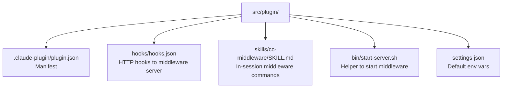

# Plugin Integration Architecture

## Overview

CC-Middleware can be installed as a Claude Code plugin, enabling it to receive hook events from interactive Claude Code sessions and provide middleware functionality directly within Claude Code.

## Plugin Mode vs SDK Mode

| Aspect | Plugin Mode | SDK Mode |
|--------|-------------|----------|
| **Sessions** | Existing interactive sessions | Programmatically launched |
| **Hooks** | HTTP hooks (POST to middleware) | TypeScript callbacks (in-process) |
| **Latency** | Higher (HTTP round-trip) | Lower (function call) |
| **Setup** | Install plugin, start server | Import and call SDK |
| **Use case** | Observe/control interactive sessions | Build automation |

Both modes dispatch to the same event bus, so consumers don't need to know the source.

## Plugin Structure



## HTTP Hook Flow

When the plugin is installed and the middleware server is running:

1. Claude Code fires a hook event (e.g., PreToolUse)
2. Plugin's `hooks.json` routes it as HTTP POST to `http://127.0.0.1:3001/hooks/PreToolUse`
3. Middleware's hook server receives the JSON payload (same format as command hook stdin)
4. Event is dispatched to the event bus
5. Blocking handler (if any) returns a `HookJSONOutput` decision
6. Server returns HTTP 200 with the `HookJSONOutput` JSON body
7. Claude Code parses the JSON and applies the decision

**HTTP hook response protocol**:
- Always return HTTP 200 with JSON body
- Empty body or `{}` = proceed (equivalent to command hook exit 0)
- JSON with `hookSpecificOutput.permissionDecision: "deny"` = block tool (equivalent to exit 2)
- JSON with `decision: "block"` = block Stop/TaskCompleted/etc.
- Non-2xx or timeout = non-blocking error (Claude continues anyway)

**Graceful degradation**: If the middleware server is not running, HTTP hooks timeout or return non-2xx. Since this produces a non-blocking error, Claude Code continues normally. The plugin does not break Claude Code when the server is down.

## Plugin Installation

```bash
# Development: load from directory
claude --plugin-dir /path/to/cc-middleware/src/plugin

# Or in Claude Code session
/reload-plugins

# Production: install from marketplace (future)
claude plugin install cc-middleware
```

## Skill Usage

The `/cc-middleware` skill provides in-session access to middleware functionality:

```
/cc-middleware status     - Show middleware server status
/cc-middleware sessions   - List recent sessions
/cc-middleware agents     - List available agents
/cc-middleware teams      - List active teams
```

The skill instructs Claude to use `WebFetch` to call the middleware's REST API.
