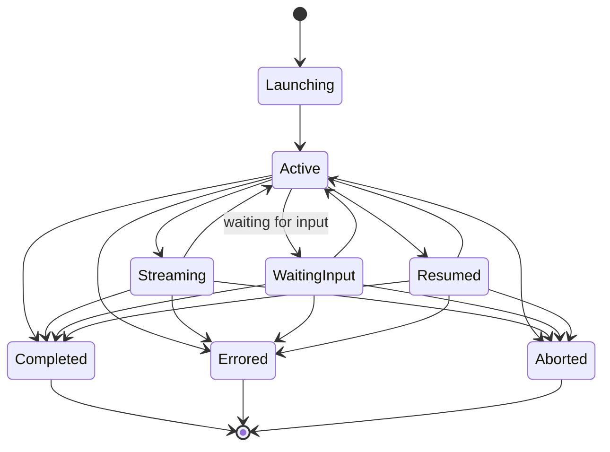

# Session Management Architecture

## Overview

The session management layer provides a unified interface over Claude Code sessions, covering discovery of past sessions, launching new headless sessions, streaming, resume/fork, and lifecycle tracking.

## V1 vs V2 SDK

We build on the **stable V1 `query()` API**. A V2 preview exists (`unstable_v2_createSession()`, `unstable_v2_resumeSession()`, `unstable_v2_prompt()`) with a session-based `send()`/`stream()` pattern that's closer to Python's `ClaudeSDKClient`. V2 is unstable and may change; we should be aware of it but not depend on it yet. Notable V2 limitations: no session forking, some advanced streaming input patterns unavailable.

## Components

### Discovery (`src/sessions/discovery.ts`)
Wraps `listSessions()` from the Agent SDK to enumerate sessions across all projects or within a specific directory.

- Normalizes `SDKSessionInfo` to our `SessionInfo` type
- `SDKSessionInfo` fields: `sessionId`, `summary`, `lastModified`, `fileSize?`, `customTitle?`, `firstPrompt?`, `gitBranch?`, `cwd?`, `tag?`, `createdAt?`
- Handles missing directories gracefully
- Sorts by last modified descending
- `includeWorktrees` defaults to `true` in the SDK (includes sessions from git worktree paths)

### Messages (`src/sessions/messages.ts`)
Wraps `getSessionMessages()` for reading session history.

- Maps raw transcript entries to `SessionMessage` type
- `SessionMessage` fields: `type` ("user"|"assistant"), `uuid`, `session_id`, `message` (raw payload from transcript), `parent_tool_use_id` (null, reserved)
- Supports pagination (limit/offset)
- Note: `message` is `unknown` type - we extract text content and tool use information from it

### Info (`src/sessions/info.ts`)
Single-session metadata operations via `getSessionInfo()`, `renameSession()`, `tagSession()`.

- `getSessionInfo(sessionId, { dir? })` returns `SDKSessionInfo | undefined`
- `renameSession(sessionId, title, { dir? })` - title must be non-empty after trimming
- `tagSession(sessionId, tag, { dir? })` - pass `null` to clear the tag

### Launcher (`src/sessions/launcher.ts`)
Wraps `query()` for launching headless sessions.

**Single-turn**: Runs to completion, returns `LaunchResult` with output, cost, session ID, and detailed usage metrics (per-model breakdown, permission denials, duration_api_ms, stop_reason, structured_output).

**Streaming**: Returns `StreamingSession` with async iterable of events, a result promise, and access to the raw `Query` object. Events include text deltas, tool use start/end, tool progress, hook lifecycle, task notifications, rate limits, compact boundaries, and more. Note: streaming is incompatible with extended thinking (`maxThinkingTokens`/`thinking: { type: 'enabled' }`) and structured output JSON streaming.

**Resume**: Takes a session ID and follow-up prompt via `options.resume`. The agent has full context from the original session. If session file is in a different `cwd`, the SDK won't find it.

**Continue**: Uses `options.continue: true` to resume the most recent session in the current directory without tracking an ID.

**Fork**: Uses `options.resume` + `options.forkSession: true` to create a new session branching from an existing one, leaving the original unchanged.

**In-memory sessions**: Set `options.persistSession: false` to disable writing to disk. Sessions cannot be resumed later.

### Manager (`src/sessions/manager.ts`)
Central coordinator that tracks active sessions and emits lifecycle events.

- Maintains a `Map<string, ActiveSession>` for sessions launched by this middleware instance
- Wraps launcher functions with tracking
- Emits events: `session:started`, `session:completed`, `session:errored`, `session:aborted`
- Provides `abort(sessionId)` via `AbortController` (passed as `options.abortController` to `query()`)
- Provides `interrupt(sessionId)` via `Query.interrupt()` for streaming input mode
- Exposes `Query` control methods: `setModel`, `setPermissionMode`, `rewindFiles`, `stopTask`, `supportedAgents`, `mcpServerStatus`, etc.
- Cleanup on `destroy()` calls `Query.close()` on all active sessions

## Session Lifecycle States



## Session Storage

Claude Code stores sessions at:
```
~/.claude/projects/<encoded-cwd>/<session-id>.jsonl
```

Each JSONL line is a transcript entry (user message, assistant message, tool use, tool result, system event). The Agent SDK handles reading and writing these files.

The middleware's SQLite index (`src/store/`) provides searchable metadata on top of this storage.

## Real-Time File Watching & Auto-Indexing

The real-time sync system (Phase 12) adds automatic detection of session file changes on disk, independent of sessions launched by the middleware itself.

### Session Watcher (`src/sync/session-watcher.ts`)
Watches `~/.claude/projects/` directories for new, modified, or removed `.jsonl` session files using chokidar with a polling fallback.

- **Discovery**: Auto-discovers all project directories under `~/.claude/projects/` (or watches specific directories if configured)
- **Events**: Emits `session:discovered` (new file), `session:updated` (modified), `session:removed` (deleted)
- **Debouncing**: New session events fire immediately; update events are debounced (default 2s) to batch rapid writes during active sessions
- **Polling fallback**: Polls at a configurable interval (default 10s) to catch changes that chokidar may miss (e.g., network filesystems)
- **WebSocket push**: All events are broadcast to connected WebSocket clients via the `session:*` subscription pattern

### Auto-Indexer (`src/sync/auto-indexer.ts`)
Listens to session watcher events and keeps the SQLite search index up to date without manual reindex.

- **Immediate indexing**: Newly discovered sessions (`session:discovered`) are indexed right away
- **Batched updates**: Modified sessions (`session:updated`) are queued and flushed every 5 seconds to avoid excessive re-indexing during active sessions
- **Statistics**: Tracks `sessionsIndexed`, `indexErrors`, `lastIndexTime`, and `pendingBatch` count
- **Resilient**: Index errors are non-fatal; sessions that fail to index are skipped silently

### Configuration
All watchers are enabled by default and can be disabled via environment variables:
- `CC_MIDDLEWARE_WATCH_SESSIONS` (default: `true`) -- Enable/disable session file watching
- `CC_MIDDLEWARE_AUTO_INDEX` (default: `true`) -- Enable/disable auto-indexing (requires session watching)
- `CC_MIDDLEWARE_POLL_INTERVAL` (default: `10000`) -- Poll interval in milliseconds
- `CC_MIDDLEWARE_DEBOUNCE_MS` (default: `2000`) -- Debounce interval in milliseconds
