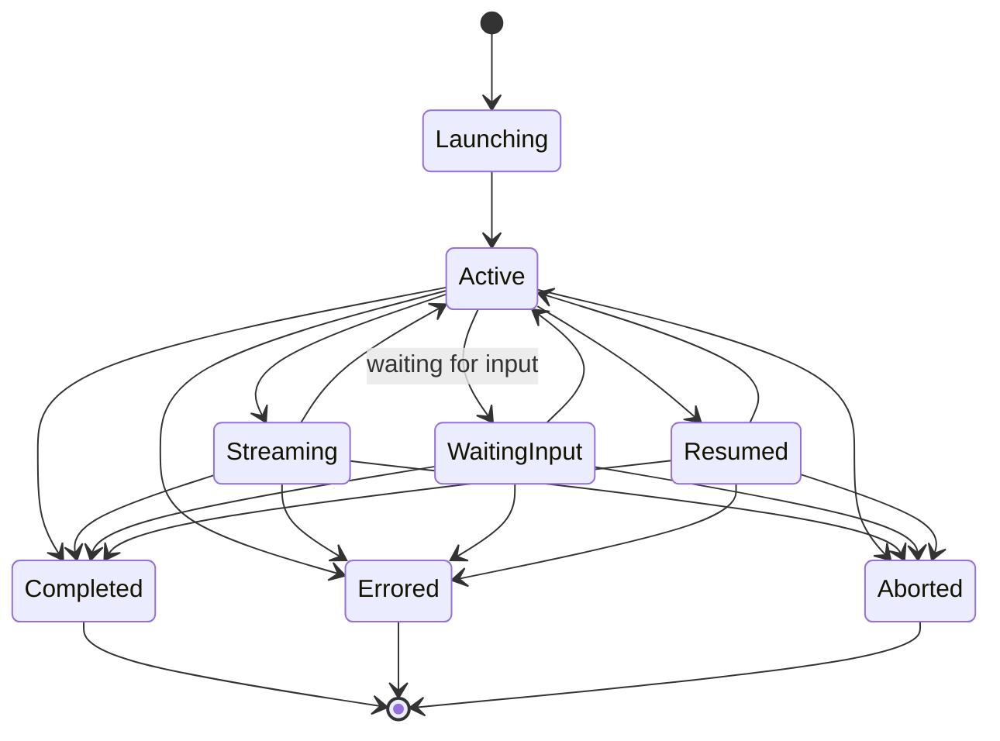

# Session Management Architecture

## Overview

The session layer is the middleware’s operational seam over Claude Code sessions. It covers:

- discovery of past sessions
- merged catalog and directory-grouped listings
- launching new headless sessions
- streaming, resume, continue, and fork
- lifecycle tracking for middleware-owned sessions
- source-of-truth session detail projections built directly from transcript files

## V1 vs V2 SDK

The middleware still builds on the stable V1 `query()` API. A V2 preview exists (`unstable_v2_createSession()`, `unstable_v2_resumeSession()`, `unstable_v2_prompt()`), but it is not yet the foundation for middleware behavior.

## Components

### Discovery (`src/sessions/discovery.ts`)

Wraps `listSessions()` from the Agent SDK to enumerate sessions across all projects or within a specific directory.

- Normalizes `SDKSessionInfo` to the middleware `SessionInfo` type
- Preserves `customTitle`, `firstPrompt`, `gitBranch`, `cwd`, `tag`, and `createdAt`
- Handles missing directories gracefully
- Sorts by last modified descending
- Keeps SDK `includeWorktrees` behavior aligned with Claude’s default session discovery

### Messages (`src/sessions/messages.ts`)

Wraps `getSessionMessages()` for reading session history.

- Maps raw transcript entries to `SessionMessage`
- Preserves raw `message` payloads for deeper normalization later
- Supports pagination
- Extracts text/tool information from opaque SDK message payloads where needed

### Info (`src/sessions/info.ts`)

Single-session metadata operations via `getSessionInfo()`, `renameSession()`, and `tagSession()`.

### Catalog (`src/sessions/catalog.ts`)

Builds the middleware-facing session catalog by combining raw discovery with indexed store metadata.

- overlays raw Claude discovery with lineage, team, and metadata information from SQLite
- supports lineage/team/metadata filtering
- powers both flat `/api/v1/sessions` and grouped `/api/v1/sessions/directories`

### Detail Builder (`src/sessions/detail.ts`)

Builds the source-of-truth session detail response used by the session detail API and playground.

Important design choice:

> This builder reads transcript files directly instead of trusting the indexed preview store.

That gives the detail surface a richer and more accurate view of:

- transcript messages and grouped turns
- tool uses and tool results
- file changes
- errors
- skills / config cues
- subagent lineage
- attached session metadata

### Launcher (`src/sessions/launcher.ts`)

Wraps `query()` for launching headless sessions.

Supported modes:

- single-turn completion
- streaming sessions
- `resume`
- `continue`
- `forkSession`
- in-memory sessions via `persistSession: false`

Launch options also flow through middleware-specific seams for:

- main-thread `agent`
- permissions via `canUseTool`
- SDK hook registration
- analytics capture metadata

### Manager (`src/sessions/manager.ts`)

Central coordinator for middleware-owned active sessions.

- tracks active sessions in memory
- wraps launcher functions with lifecycle tracking
- emits `session:started`, `session:completed`, `session:errored`, `session:aborted`
- exposes abort/interrupt and selected `Query` control methods
- closes open queries on shutdown

## Launch Plumbing

Middleware-owned launches from REST, WebSocket, and dispatch all reuse the same session-manager path.

That shared path is important because it keeps:

- permission handling
- SDK hook bridging
- analytics capture
- session ID propagation

consistent across interactive API launches and background dispatch work.

## Session Lifecycle States



## Session Storage

Claude Code stores sessions at:

```text
~/.claude/projects/<encoded-cwd>/<session-id>.jsonl
```

Subagent transcript work may also appear beneath the session directory in sidechain transcript files. The detail builder and analytics importer read those files directly when they need richer structure than the SDK session preview provides.

The middleware’s SQLite store adds:

- searchable session catalog data
- lineage overlays
- session metadata definitions and values
- generalized resource metadata for non-session resources

## Real-Time File Watching & Auto-Indexing

The real-time sync system keeps the session catalog fresh even for sessions the middleware did not launch itself.

### Session Watcher (`src/sync/session-watcher.ts`)

- watches `~/.claude/projects/` for new, modified, or removed `.jsonl` files
- emits `session:discovered`, `session:updated`, `session:removed`
- uses immediate create handling plus debounced updates
- falls back to polling where needed

### Auto-Indexer (`src/sync/auto-indexer.ts`)

- indexes newly discovered sessions immediately
- batches updates during active transcript churn
- keeps the SQLite search/metadata layer aligned with filesystem truth

## API Surfaces Backed by This Layer

The session architecture currently powers:

- `/api/v1/sessions`
- `/api/v1/sessions/directories`
- `/api/v1/sessions/:id`
- `/api/v1/sessions/:id/messages`
- `/api/v1/sessions/:id/detail`
- `/api/v1/sessions/:id/metadata`
- `/api/v1/sessions/metadata/definitions`
