# Phase 12: Real-Time Sync

**Status**: Not Started
**Depends On**: Phase 7 (API Layer), Phase 9 (Search & Indexing)
**Priority**: HIGH - Without this, the middleware shows stale data when Claude Code runs outside it

## Problem

The middleware only knows about changes when explicitly asked (on-demand API calls). Regular Claude Code sessions, team changes, config edits, and new sessions are invisible until the next API request. The search index goes stale. WebSocket subscribers don't get notified of external changes.

## Goal

Make the middleware automatically detect and react to changes from external Claude Code sessions by watching the filesystem and polling where needed. Push updates to WebSocket subscribers in real-time.

## Architecture

```mermaid
flowchart TD
    watchers["Filesystem Watchers"]
    session["Session watcher<br/>~/.claude/projects/*/*.jsonl"]
    team["Team watcher<br/>~/.claude/teams/"]
    config["Config watcher"]
    component["Component watcher"]
    ws["WebSocket broadcast<br/>connected clients"]
    index["Incremental search index update"]

    watchers --> session
    watchers --> team
    watchers --> config
    watchers --> component

    session --> sessionNew["New session file<br/>index and emit session:discovered"]
    session --> sessionUpdated["Modified session file<br/>re-index and emit session:updated"]
    session --> sessionPoll["Polling fallback for large dirs"]

    team --> teamCreated["New team config<br/>emit team:created"]
    team --> teamUpdated["Modified team config<br/>emit team:updated"]
    team --> teamTask["Task file changes<br/>emit team:task-updated"]

    config --> cfgUser["~/.claude/settings.json<br/>emit config:changed"]
    config --> cfgProject[".claude/settings.json<br/>emit config:changed"]
    config --> cfgGlobal["~/.claude.json<br/>emit config:changed (MCP, global)"]
    config --> cfgMcp[".mcp.json<br/>emit config:changed"]

    component --> compAgent[".claude/agents/*.md<br/>emit agent:changed"]
    component --> compSkill[".claude/skills/*/SKILL.md<br/>emit skill:changed"]
    component --> compRule[".claude/rules/*.md<br/>emit rule:changed"]

    session --> ws
    team --> ws
    config --> ws
    component --> ws
    session --> index
```



## Approach: `fs.watch` + Polling Hybrid

`fs.watch` (Node.js native) is fast but unreliable across platforms (missed events, no recursive on Linux). Strategy:
- Use `fs.watch` for immediate detection where available
- Poll at intervals as a fallback and consistency check
- Debounce rapid changes (JSONL files update frequently during active sessions)

Consider using `chokidar` (mature file watcher) if `fs.watch` proves too unreliable.

---

## Task 12.1: Session File Watcher

### Implementation: `src/sync/session-watcher.ts`

```typescript
export interface SessionWatcherOptions {
  projectDirs?: string[];      // Specific dirs, or discover all from ~/.claude/projects/
  pollIntervalMs?: number;     // Fallback poll interval (default: 10000 = 10s)
  debounceMs?: number;         // Debounce rapid changes (default: 2000 = 2s)
}

export class SessionWatcher extends EventEmitter {
  constructor(options: SessionWatcherOptions)

  start(): Promise<void>
  stop(): Promise<void>

  // Events emitted:
  // 'session:discovered' - New session file appeared
  // 'session:updated' - Existing session file modified
  // 'session:removed' - Session file deleted (rare but possible)
}
```

**Behavior**:
- Scan `~/.claude/projects/` for all project directories
- Watch each `<project-dir>/*.jsonl` for changes
- On new .jsonl file: emit `session:discovered` with session ID parsed from filename
- On modified .jsonl file: emit `session:updated` with session ID
- Debounce updates (active sessions write to JSONL frequently)
- Poll every `pollIntervalMs` to catch any missed events
- Track known files and their mtimes to detect changes on poll

### Verification

```typescript
// Test: Detect new session file
// 1. Start watcher on a temp directory
// 2. Create a .jsonl file in the watched directory
// 3. Verify session:discovered event fires within 5s
// 4. Verify event includes the session ID

// Test: Detect modified session file
// 1. Start watcher, create initial file
// 2. Append to the file
// 3. Verify session:updated event fires (debounced)

// Test: Poll catches missed events
// 1. Start watcher with short poll interval (1s)
// 2. Create file (simulating a missed fs.watch event)
// 3. Verify poll detects it
```

---

## Task 12.2: Config & Component Watcher

### Implementation: `src/sync/config-watcher.ts`

```typescript
export interface ConfigWatcherOptions {
  projectDir?: string;
  pollIntervalMs?: number;     // Default: 30000 (30s - config changes less often)
  debounceMs?: number;         // Default: 1000
}

export class ConfigWatcher extends EventEmitter {
  constructor(options: ConfigWatcherOptions)

  start(): Promise<void>
  stop(): Promise<void>

  // Events:
  // 'config:settings-changed' - Any settings.json changed (with scope)
  // 'config:mcp-changed' - MCP config changed
  // 'config:agent-changed' - Agent definition added/modified/removed
  // 'config:skill-changed' - Skill added/modified/removed
  // 'config:rule-changed' - Rule added/modified/removed
  // 'config:plugin-changed' - Plugin state changed
  // 'config:memory-changed' - Memory files changed
  // 'team:created' / 'team:updated' / 'team:task-updated'
}
```

**Watched paths**:
- `~/.claude/settings.json`
- `~/.claude/settings.local.json`
- `.claude/settings.json`
- `.claude/settings.local.json`
- `~/.claude.json` (MCP, global config)
- `.mcp.json`
- `.claude/agents/*.md`
- `~/.claude/agents/*.md`
- `.claude/skills/*/SKILL.md`
- `.claude/rules/*.md`
- `~/.claude/teams/*/config.json`
- `~/.claude/tasks/*`
- `~/.claude/plugins/installed_plugins.json`

### Verification

```typescript
// Test: Detect settings change
// 1. Start watcher
// 2. Modify a settings file
// 3. Verify config:settings-changed fires with correct scope

// Test: Detect new agent definition
// 1. Start watcher
// 2. Create a new .md file in .claude/agents/
// 3. Verify config:agent-changed fires
```

---

## Task 12.3: Incremental Auto-Index

### Implementation: `src/sync/auto-indexer.ts`

```typescript
export interface AutoIndexerOptions {
  sessionWatcher: SessionWatcher;
  store: SessionStore;
  indexer: SessionIndexer;
  batchIntervalMs?: number;    // Batch index updates (default: 5000)
}

export class AutoIndexer {
  constructor(options: AutoIndexerOptions)

  start(): void
  stop(): void

  // Listens to session watcher events and automatically
  // indexes new/updated sessions into the SQLite store
}
```

**Behavior**:
- Listen to `session:discovered` and `session:updated` events
- Batch updates: collect session IDs for `batchIntervalMs`, then index them all at once
- Use `indexer.indexSession(sessionId)` for individual updates (already uses getSessionInfo, not full scan)
- On `session:discovered`: index immediately (new sessions are interesting)
- On `session:updated`: batch (updates are frequent during active sessions)
- Track indexing stats (sessions indexed, errors, last index time)

### Verification

```typescript
// Test: Auto-index new session
// 1. Create auto-indexer with session watcher
// 2. Create a new session file in watched directory
// 3. Wait for batch interval
// 4. Verify session appears in search index

// Test: Batch updates
// 1. Rapidly create/modify multiple session files
// 2. Verify they're batched into fewer index operations
```

---

## Task 12.4: WebSocket Push for External Changes

### Implementation: Update `src/api/websocket.ts`

Wire the watchers into the WebSocket broadcast system so connected clients get real-time updates.

```typescript
// New event types for WebSocket:
{ type: "session:discovered", sessionId: string, timestamp: number }
{ type: "session:updated", sessionId: string, timestamp: number }
{ type: "config:changed", scope: string, path: string, timestamp: number }
{ type: "team:created", teamName: string, timestamp: number }
{ type: "team:updated", teamName: string, timestamp: number }
{ type: "agent:changed", name: string, action: "created"|"modified"|"removed" }
```

**Behavior**:
- Watcher events are forwarded to all WebSocket subscribers
- Subscribers can filter by event type (existing subscription mechanism)
- Events include enough detail for clients to decide whether to refresh

### Verification

```typescript
// Test: WebSocket receives session:discovered
// 1. Connect WebSocket, subscribe to session:*
// 2. Create a session file in watched directory
// 3. Verify WebSocket receives session:discovered event
```

---

## Task 12.5: Wire Everything into Server Startup

### Implementation: Update `src/main.ts`

```typescript
// Add to server startup:
const sessionWatcher = new SessionWatcher({ projectDirs: [projectDir] });
const configWatcher = new ConfigWatcher({ projectDir });
const autoIndexer = new AutoIndexer({ sessionWatcher, store, indexer });

await sessionWatcher.start();
await configWatcher.start();
autoIndexer.start();

// Wire to WebSocket
sessionWatcher.on('session:discovered', (data) => wsBroadcast('session:discovered', data));
sessionWatcher.on('session:updated', (data) => wsBroadcast('session:updated', data));
configWatcher.on('config:settings-changed', (data) => wsBroadcast('config:changed', data));
// ... etc

// On shutdown:
autoIndexer.stop();
await configWatcher.stop();
await sessionWatcher.stop();
```

Also add a status endpoint that shows watcher state:
```
GET /api/v1/status -> { ..., watchers: { sessions: { watching: true, dirs: [...], lastPoll: ... }, config: { watching: true, ... } } }
```

### Verification

```typescript
// Test: Full integration - start server, create session, verify auto-indexed and WS notified
// 1. Start middleware server with watchers
// 2. Connect WebSocket
// 3. Launch a session via regular `claude -p` (not through middleware)
// 4. Verify WebSocket receives session:discovered
// 5. Verify session appears in search index
// 6. Verify GET /api/v1/sessions includes the new session
```

---

## Task 12.6: Watcher Configuration

### Implementation: Update settings/config

Allow controlling watcher behavior:

```typescript
// Environment variables:
CC_MIDDLEWARE_WATCH_SESSIONS=true       // Enable session watching (default: true)
CC_MIDDLEWARE_WATCH_CONFIG=true         // Enable config watching (default: true)
CC_MIDDLEWARE_AUTO_INDEX=true           // Enable auto-indexing (default: true)
CC_MIDDLEWARE_POLL_INTERVAL=10000       // Poll interval in ms
CC_MIDDLEWARE_DEBOUNCE_MS=2000          // Debounce interval
CC_MIDDLEWARE_WATCH_DIRS=/path1,/path2  // Additional watch directories
```

Add CLI commands:
```
ccm server status   -> shows watcher state
ccm sync status     -> show what's being watched, last poll times, pending index
ccm sync reindex    -> trigger immediate full reindex
```

### Verification

```typescript
// Test: Watchers can be disabled
// 1. Start server with CC_MIDDLEWARE_WATCH_SESSIONS=false
// 2. Verify no session watcher is running
// 3. Verify manual API calls still work
```
