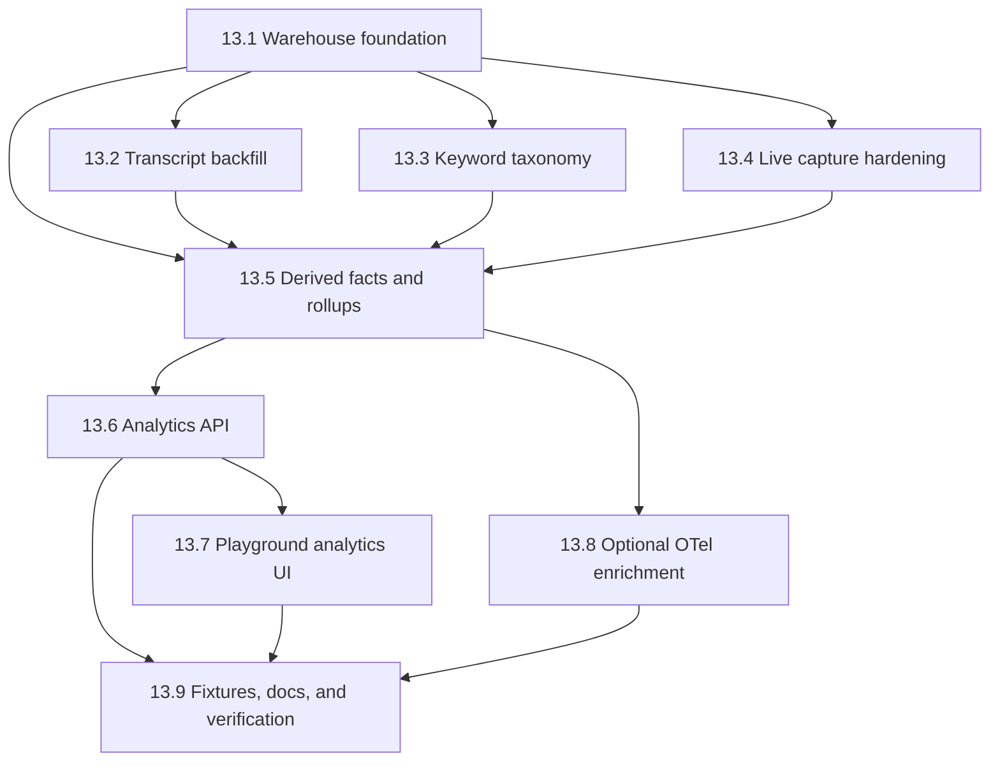

# Phase 13: Analytics & Developer Insights

**Status**: Completed
**Depends On**: Phase 3 (Session Launching), Phase 4 (Event System), Phase 5 (Permission Handling), Phase 7 (API Layer), Phase 9 (Search & Indexing), Phase 10 (Configuration Management), Phase 12 (Real-Time Sync)
**Priority**: HIGH - This is the foundation for developer-facing observability and retrospective analytics
**Blocks**: Analytics API, analytics playground views, reliable cost/error/keyword reporting

## Problem

The middleware currently exposes sessions, hooks, permissions, teams, and search, but it does not provide a developer-grade analytics layer over Claude Code activity.

We need:

- Backfill from existing session history
- Local analytics over costs, tokens, context growth, errors, tool use, and subagents
- Keyword-based prompt analytics (frustration, cursing, insults, etc.)
- Trace-like interaction search and drilldown
- A UI for slicing and comparing these signals over time

Claude Code OpenTelemetry is helpful for live enrichment, but it cannot be the foundation because it is not retroactive.

## Goal

Build a local analytics system that:

1. Uses transcript history as the primary source of truth
2. Stores raw and derived analytics in DuckDB
3. Captures middleware-launched sessions with richer live data
4. Exposes analytics through a dedicated API
5. Presents the data in the playground with charting and drilldown

## Non-Goals

- Billing-grade financial reconciliation for every historical request
- Non-English keyword models in v1
- Cloud-hosted analytics or multi-machine synchronization
- Embedding-based semantic analytics in v1
- Depending on OpenTelemetry for correctness

## Research References

- [../../research/analytics-sources.md](../../research/analytics-sources.md)
- [../../architecture/analytics-system.md](../../architecture/analytics-system.md)
- [../../architecture/session-management.md](../../architecture/session-management.md)
- [../../architecture/event-system.md](../../architecture/event-system.md)
- [../../architecture/permission-system.md](../../architecture/permission-system.md)

External references:

- [Claude Code monitoring / OpenTelemetry](https://code.claude.com/docs/en/monitoring-usage)
- [Claude Code hooks reference](https://code.claude.com/docs/en/hooks)
- [Claude Code CLI reference](https://code.claude.com/docs/en/cli-reference)
- [Agent SDK TypeScript reference](https://platform.claude.com/docs/en/agent-sdk/typescript)
- [How the agent loop works](https://platform.claude.com/docs/en/agent-sdk/agent-loop)
- [Agent Skills in the SDK](https://platform.claude.com/docs/en/agent-sdk/skills)
- [DuckDB Node client](https://duckdb.org/docs/1.3/clients/node_neo/overview.html)
- [DuckDB SQLite extension](https://duckdb.org/docs/current/core_extensions/sqlite)
- [DuckDB full-text search](https://duckdb.org/docs/current/core_extensions/full_text_search)
- [shadcn/ui chart](https://ui.shadcn.com/docs/components/base/chart)

## Quality Gates

These commands must pass for every implementation story in this phase:

- `npm run build`
- `npx vitest run <affected-test-files>`

For playground stories, also require:

- `npm run playground:build`

Notes:

- Do **not** use `npm test` as the mandatory gate for this phase. The repo currently has live-session tests that can fail under Claude usage limits.
- Every story in this phase should add or update targeted tests or fixture-driven verification.

## Architecture Summary

## Parallel Execution Plan

These workstreams are intentionally split into mostly disjoint write sets.

### Workstream A: Warehouse Foundation

Owns:

- `package.json`
- `src/analytics/db.ts`
- `src/analytics/types.ts`
- `src/analytics/schema/`
- `tests/unit/analytics-db.test.ts`

### Workstream B: Transcript Backfill

Owns:

- `src/analytics/backfill/`
- `tests/unit/analytics-backfill.test.ts`
- `tests/fixtures/analytics/transcripts/`

Reference-only inputs:

- [../../../src/sessions/transcripts.ts](../../../src/sessions/transcripts.ts)
- [../../../src/sessions/messages.ts](../../../src/sessions/messages.ts)

### Workstream C: Live Capture Hardening

Owns:

- `src/analytics/live/`
- `src/sessions/launcher.ts`
- `src/sessions/streaming.ts`
- `src/api/routes/sessions.ts`
- `src/api/websocket.ts`
- `src/permissions/handler.ts`
- `src/plugin/hooks/hooks.json`

### Workstream D: Keywords and Derived Metrics

Owns:

- `src/analytics/keywords/`
- `src/analytics/pricing.ts`
- `src/analytics/derive/`
- `tests/unit/analytics-keywords.test.ts`

### Workstream E: Analytics API

Owns:

- `src/types/analytics.ts`
- `src/api/routes/analytics.ts`
- `src/api/server.ts`
- `tests/e2e/api-analytics.test.ts`

### Workstream F: Playground UI

Owns:

- `playground/src/lib/playground.ts`
- `playground/src/pages/analytics-page.tsx`
- `playground/src/components/analytics-*.tsx`
- `playground/src/components/playground-ui.tsx`

## Task 13.1: Analytics Warehouse Foundation

### Goal

Create the analytics package, DuckDB connection layer, migrations, and configuration plumbing.

### Implementation

Recommended files:

- `src/analytics/db.ts`
- `src/analytics/types.ts`
- `src/analytics/schema/0001_init.sql`
- `src/analytics/index.ts`

Recommended dependency:

- `@duckdb/node-api`

Configuration:

- `CC_MIDDLEWARE_ANALYTICS_DB_PATH` defaulting to `~/.cc-middleware/analytics.duckdb`

### Acceptance Criteria

- [ ] The repo has a dedicated analytics module under `src/analytics/`
- [ ] DuckDB database creation and migration work from a configurable local path
- [ ] Raw table scaffolding exists for transcript, middleware, and optional OTel events
- [ ] Unit tests cover database initialization and idempotent migrations

### Related Files

- [../../../package.json](../../../package.json)
- [../../../src/store/db.ts](../../../src/store/db.ts)

---

## Task 13.2: Transcript Backfill Importer

### Goal

Import raw root and sidechain transcript history into DuckDB without losing detail.

### Implementation

Create a raw importer that walks:

- `~/.claude/projects/<encoded-cwd>/<session-id>.jsonl`
- `~/.claude/projects/<encoded-cwd>/<session-id>/subagents/*.jsonl`

Recommended files:

- `src/analytics/backfill/transcript-discovery.ts`
- `src/analytics/backfill/transcript-parser.ts`
- `src/analytics/backfill/import-transcripts.ts`

### Acceptance Criteria

- [ ] The importer ingests one raw warehouse row per transcript line
- [ ] Root sessions and subagent transcripts are both imported
- [ ] The importer stores source path, line number, timestamp, type, subtype, session ID, and raw JSON payload
- [ ] Re-running the importer is idempotent through dedupe keys
- [ ] Fixture-driven tests cover root sessions, subagents, API errors, and compact boundaries

### Related Files

- [../../../src/sessions/transcripts.ts](../../../src/sessions/transcripts.ts)
- [../../../src/sessions/messages.ts](../../../src/sessions/messages.ts)
- [../../../src/store/indexer.ts](../../../src/store/indexer.ts)

---

## Task 13.3: Keyword Taxonomy and Matching Engine

### Goal

Implement deterministic English keyword analytics for frustration, cursing, insults, and related categories.

### Implementation

Recommended files:

- `src/analytics/keywords/en.ts`
- `src/analytics/keywords/matcher.ts`
- `src/analytics/keywords/types.ts`

V1 categories:

- frustration
- cursing
- insult
- aggression
- urgency

### Acceptance Criteria

- [ ] Keyword dictionaries and regex rules are versioned in code
- [ ] Matching stores term, category, severity, speaker, timestamp, and interaction/session joins
- [ ] False-positive guardrails are documented and tested
- [ ] The engine can run during backfill and on live-captured prompts

### Related Files

- [../../../src/sessions/messages.ts](../../../src/sessions/messages.ts)
- [../../research/analytics-sources.md](../../research/analytics-sources.md)

---

## Task 13.4: Live Capture Hardening for Middleware Sessions

### Goal

Ensure middleware-launched sessions produce complete analytics data, not just historical backfill.

### Implementation

Required changes:

- Pass analytics-related launch plumbing through REST and WebSocket launch paths
- Persist raw SDK message streams before they are normalized away
- Capture permission and hook events with real session join keys
- Expand plugin hook coverage for interactive sessions

Recommended files:

- `src/analytics/live/sdk-sink.ts`
- `src/analytics/live/event-sink.ts`
- `src/api/routes/sessions.ts`
- `src/api/websocket.ts`
- `src/sessions/launcher.ts`
- `src/sessions/streaming.ts`
- `src/permissions/handler.ts`
- `src/plugin/hooks/hooks.json`

### Acceptance Criteria

- [ ] Middleware-launched sessions emit raw SDK analytics records
- [ ] Permission requests include actual `session_id` and `cwd`
- [ ] Raw streaming persistence preserves compact boundaries, rate limits, task events, and hook lifecycle records
- [ ] Plugin sessions forward analytics-relevant hook events beyond the current minimal set

### Related Files

- [../../../src/main.ts](../../../src/main.ts)
- [../../../src/api/routes/sessions.ts](../../../src/api/routes/sessions.ts)
- [../../../src/api/websocket.ts](../../../src/api/websocket.ts)
- [../../../src/sessions/launcher.ts](../../../src/sessions/launcher.ts)
- [../../../src/sessions/streaming.ts](../../../src/sessions/streaming.ts)
- [../../../src/hooks/sdk-bridge.ts](../../../src/hooks/sdk-bridge.ts)
- [../../../src/permissions/handler.ts](../../../src/permissions/handler.ts)
- [../../../src/plugin/hooks/hooks.json](../../../src/plugin/hooks/hooks.json)

---

## Task 13.5: Derived Facts and Rollups

### Goal

Turn raw transcript and live-capture data into query-friendly fact tables and rollups.

### Implementation

Recommended derived tables:

- `fact_interactions`
- `fact_requests`
- `fact_tool_calls`
- `fact_errors`
- `fact_subagent_runs`
- `fact_compactions`
- `fact_keyword_mentions`
- `fact_permission_decisions`
- `rollup_metrics_hourly`
- `rollup_metrics_daily`

Add a versioned model-pricing table for cost derivation.

### Acceptance Criteria

- [ ] Interaction traces are derivable from transcript ordering and sidechain joins
- [ ] Request facts include token usage, model, duration when available, and estimated cost
- [ ] Error facts include API, tool, permission, and middleware failures
- [ ] Compaction boundaries are modeled explicitly
- [ ] Context growth is exposed as an estimated request/session metric, not mislabeled as an exact internal value
- [ ] Hourly rollups support charting without full-table scans on every request

### Related Files

- [../../../src/config/global.ts](../../../src/config/global.ts)
- [../../architecture/analytics-system.md](../../architecture/analytics-system.md)

---

## Task 13.6: Analytics API

### Goal

Expose analytics data through dedicated REST endpoints.

### Implementation

Recommended route module:

- `src/api/routes/analytics.ts`

Recommended endpoints:

- `GET /api/v1/analytics/status`
- `GET /api/v1/analytics/overview`
- `GET /api/v1/analytics/timeseries`
- `GET /api/v1/analytics/traces`
- `GET /api/v1/analytics/traces/:id`
- `GET /api/v1/analytics/sessions/:id`
- `GET /api/v1/analytics/facets`
- `POST /api/v1/analytics/backfill`

### Acceptance Criteria

- [ ] Analytics routes are registered in the main server
- [ ] Time-range filtering and faceting work across tokens, errors, keywords, and tools
- [ ] Trace search returns interaction-level detail and links back to session IDs
- [ ] Session analytics detail exposes subagent, tool, error, and keyword summaries
- [ ] Backfill status and progress are queryable

### Related Files

- [../../../src/api/server.ts](../../../src/api/server.ts)
- [../../../docs/api/README.md](../../../docs/api/README.md)

---

## Task 13.7: Playground Analytics View

### Goal

Present analytics in a local UI with time slicing, overlays, and drilldown.

### Implementation

Recommended additions:

- `playground/src/pages/analytics-page.tsx`
- `playground/src/components/analytics-timeseries.tsx`
- `playground/src/components/analytics-trace-table.tsx`
- `playground/src/components/analytics-drawer.tsx`

Likely dependency additions:

- `recharts`

### Acceptance Criteria

- [ ] The playground navigation includes an analytics page
- [ ] Charts support a selectable time range and synchronized hover/brush behavior
- [ ] Users can overlay keyword incidence, errors, estimated cost, input tokens, output tokens, and context estimate
- [ ] A trace/session table supports drilldown into one interaction or session
- [ ] The page builds cleanly with `npm run playground:build`

### Related Files

- [../../../playground/src/lib/playground.ts](../../../playground/src/lib/playground.ts)
- [../../../playground/src/components/playground-ui.tsx](../../../playground/src/components/playground-ui.tsx)
- [../../../playground/src/pages/overview-page.tsx](../../../playground/src/pages/overview-page.tsx)
- [../../architecture/analytics-system.md](../../architecture/analytics-system.md)

---

## Task 13.8: Optional OpenTelemetry Enrichment

### Goal

Add optional support for ingesting Claude Code OTel logs/spans when available, without making the system depend on them.

### Implementation

Recommended files:

- `src/analytics/otel/importer.ts`
- `src/analytics/otel/types.ts`

Use OTel only to enrich:

- `prompt.id`
- span/trace IDs
- tool parameters and skill names
- request-level estimated cost from live telemetry

### Acceptance Criteria

- [ ] OTel ingestion can be enabled or disabled independently
- [ ] The system still works fully without OTel data
- [ ] OTel facts join cleanly to transcript/middleware interactions when possible
- [ ] Privacy-sensitive fields are explicitly gated

### Related Files

- [../../research/analytics-sources.md](../../research/analytics-sources.md)
- [../../architecture/analytics-system.md](../../architecture/analytics-system.md)

---

## Task 13.9: Fixtures, Verification, and Documentation

### Goal

Make the analytics system safe for parallel implementation and future maintenance.

### Implementation

Deliverables:

- Redacted transcript fixtures
- Targeted unit and API tests
- Updated architecture, research, and API docs
- A short operator guide for running backfill locally

### Acceptance Criteria

- [ ] Fixtures cover compact boundaries, API errors, tool-result failures, and subagents
- [ ] Tests verify both backfill and live capture paths
- [ ] Docs explain what is exact, estimated, historical-only, or live-only
- [ ] Parallel worker write scopes are documented and current

## Suggested Story Order

1. 13.1 Warehouse foundation
2. 13.2 Transcript backfill, 13.3 Keywords, and 13.4 Live capture in parallel
3. 13.5 Derived facts and rollups
4. 13.6 Analytics API
5. 13.7 Playground UI
6. 13.8 Optional OTel enrichment
7. 13.9 Verification and documentation polish

## Completion Criteria

This phase is complete when:

1. Historical session transcripts can be imported into DuckDB and queried locally
2. Middleware-launched sessions generate live analytics records with correct joins
3. Keyword, error, tool, token, cost, subagent, and compaction analytics are exposed through the API
4. The playground provides a usable analytics surface for slicing, filtering, and drilldown
5. OTel remains optional and non-blocking
