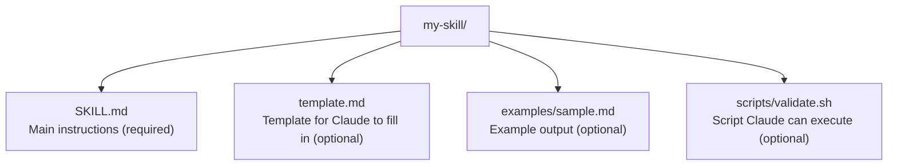

# Skills, Agents, Rules, and Commands

## Overview

Claude Code has four related systems for extending behavior:
- **Skills**: Markdown files (SKILL.md) that provide instructions, invocable by `/name` or automatically by Claude
- **Agents (Subagents)**: Markdown files that define specialized AI assistants with custom prompts, tools, and models
- **Rules**: Path-scoped markdown files in `.claude/rules/` that conditionally load instructions
- **Commands**: Legacy markdown files in `commands/` (merged into skills system, still supported)
- **CLAUDE.md**: Persistent project/user instructions (covered separately in memory-system.md)

All follow the [Agent Skills](https://agentskills.io) open standard with Claude Code extensions.

## File Locations

### Skills

| Location | Path | Scope | Shared |
|----------|------|-------|--------|
| Enterprise | Managed settings directory | All users | Yes (IT) |
| Personal | `~/.claude/skills/<skill-name>/SKILL.md` | All your projects | No |
| Project | `.claude/skills/<skill-name>/SKILL.md` | This project | Yes |
| Plugin | `<plugin>/skills/<skill-name>/SKILL.md` | Where enabled | Yes |
| Nested | `<subdir>/.claude/skills/...` | Auto-discovered | Yes |
| Additional dir | `--add-dir` path's `.claude/skills/` | Session only | No |

Priority (highest wins): enterprise > personal > project. Plugin skills use `plugin-name:skill-name` namespace so they never conflict.

### Agents (Subagents)

| Location | Scope | Priority |
|----------|-------|----------|
| Managed settings `.claude/agents/` | Organization-wide | 1 (highest) |
| `--agents` CLI flag (JSON) | Current session | 2 |
| `.claude/agents/` (project) | Current project | 3 |
| `~/.claude/agents/` (user) | All your projects | 4 |
| Plugin `agents/` directory | Where enabled | 5 (lowest) |

### Rules

| Location | Scope |
|----------|-------|
| `~/.claude/rules/*.md` | Personal, all projects |
| `.claude/rules/*.md` | Project-specific |

User-level rules load before project rules; project rules have higher priority.

### Commands (Legacy)

| Location | Scope |
|----------|-------|
| `~/.claude/commands/*.md` | Personal |
| `.claude/commands/*.md` | Project |
| Plugin `commands/` | Where enabled |

If a skill and command share the same name, the skill takes precedence.

## Skill Format (SKILL.md)

### Directory Structure


### Frontmatter Reference

```yaml
---
name: my-skill
description: What this skill does and when to use it
argument-hint: "[issue-number]"
disable-model-invocation: true
user-invocable: false
allowed-tools: Read Grep Glob
model: sonnet
effort: medium
context: fork
agent: Explore
hooks:
  PreToolUse:
    - matcher: "Bash"
      hooks:
        - type: command
          command: "./validate.sh"
paths:
  - "src/api/**/*.ts"
shell: bash
---

Skill instructions here...
```

| Field | Required | Type | Default | Description |
|-------|----------|------|---------|-------------|
| `name` | No | string | directory name | Display name, lowercase+hyphens, max 64 chars |
| `description` | Recommended | string | first paragraph | When to use; truncated at 250 chars in listing |
| `argument-hint` | No | string | - | Shown during autocomplete |
| `disable-model-invocation` | No | boolean | false | Prevent Claude from auto-loading |
| `user-invocable` | No | boolean | true | Show in `/` menu |
| `allowed-tools` | No | string/list | - | Tools allowed without permission prompts |
| `model` | No | string | - | Model override when active |
| `effort` | No | string | inherit | `low`, `medium`, `high`, `max` |
| `context` | No | string | - | `fork` to run in subagent |
| `agent` | No | string | `general-purpose` | Agent type when `context: fork` |
| `hooks` | No | object | - | Hooks scoped to skill lifecycle |
| `paths` | No | string/list | - | Glob patterns for conditional activation |
| `shell` | No | string | `bash` | `bash` or `powershell` |

### String Substitutions

| Variable | Description |
|----------|-------------|
| `$ARGUMENTS` | All arguments passed to skill |
| `$ARGUMENTS[N]` / `$N` | Specific argument by index (0-based) |
| `${CLAUDE_SESSION_ID}` | Current session ID |
| `${CLAUDE_SKILL_DIR}` | Directory containing SKILL.md |

### Dynamic Context Injection

`` !`command` `` runs a shell command before sending to Claude. Output replaces the placeholder.

````markdown
## Context
- PR diff: !`gh pr diff`
- Changed files: !`gh pr diff --name-only`
```!
node --version
npm --version
```
````

Can be disabled with `disableSkillShellExecution: true` in settings.

## Agent (Subagent) Format

Agent files are Markdown with YAML frontmatter. The body becomes the system prompt.

### Frontmatter Reference

```yaml
---
name: code-reviewer
description: Reviews code for quality and best practices
tools: Read, Glob, Grep
disallowedTools: Write, Edit
model: sonnet
permissionMode: default
maxTurns: 20
skills:
  - api-conventions
  - error-handling-patterns
mcpServers:
  - playwright:
      type: stdio
      command: npx
      args: ["-y", "@playwright/mcp@latest"]
  - github
hooks:
  PreToolUse:
    - matcher: "Bash"
      hooks:
        - type: command
          command: "./validate-readonly.sh"
memory: user
background: false
effort: medium
isolation: worktree
color: blue
initialPrompt: /review-all
---

You are a code reviewer. Analyze code and provide feedback...
```

| Field | Required | Type | Description |
|-------|----------|------|-------------|
| `name` | Yes | string | Unique identifier (lowercase + hyphens) |
| `description` | Yes | string | When Claude should delegate to this agent |
| `tools` | No | string (CSV) | Allowlist of tools; inherits all if omitted |
| `disallowedTools` | No | string (CSV) | Tools to deny (removed from inherited list) |
| `model` | No | string | `sonnet`, `opus`, `haiku`, full ID, or `inherit` (default) |
| `permissionMode` | No | string | `default`, `acceptEdits`, `auto`, `dontAsk`, `bypassPermissions`, `plan` |
| `maxTurns` | No | number | Maximum agentic turns |
| `skills` | No | list | Skills to preload into context |
| `mcpServers` | No | list | MCP servers (inline definitions or string references) |
| `hooks` | No | object | Lifecycle hooks scoped to agent |
| `memory` | No | string | `user`, `project`, or `local` for persistent memory |
| `background` | No | boolean | Always run as background task (default: false) |
| `effort` | No | string | `low`, `medium`, `high`, `max` |
| `isolation` | No | string | `worktree` for isolated git worktree |
| `color` | No | string | `red`, `blue`, `green`, `yellow`, `purple`, `orange`, `pink`, `cyan` |
| `initialPrompt` | No | string | Auto-submitted first user turn when running as main agent |

### Model Resolution Order

1. `CLAUDE_CODE_SUBAGENT_MODEL` env var
2. Per-invocation `model` parameter
3. Agent definition's `model` frontmatter
4. Main conversation's model

### Built-in Subagents

| Agent | Model | Tools | Purpose |
|-------|-------|-------|---------|
| Explore | Haiku | Read-only | Fast codebase search/analysis |
| Plan | Inherits | Read-only | Research for planning |
| general-purpose | Inherits | All | Complex multi-step tasks |
| statusline-setup | Sonnet | - | /statusline configuration |
| Claude Code Guide | Haiku | - | Feature questions |

### Plugin Agent Restrictions

Plugin agents do NOT support: `hooks`, `mcpServers`, `permissionMode` (silently ignored for security).

### CLI-Defined Agents

```bash
claude --agents '{
  "reviewer": {
    "description": "...",
    "prompt": "...",
    "tools": ["Read", "Grep"],
    "model": "sonnet"
  }
}'
```

### Agent Memory

| Scope | Location |
|-------|----------|
| `user` | `~/.claude/agent-memory/<agent-name>/` |
| `project` | `.claude/agent-memory/<agent-name>/` |
| `local` | `.claude/agent-memory-local/<agent-name>/` |

When memory enabled: first 200 lines or 25KB of `MEMORY.md` injected at startup. Read/Write/Edit tools auto-enabled.

## Rules Format (`.claude/rules/`)

Rules are markdown files with optional path-scoping frontmatter:

```markdown
---
paths:
  - "src/api/**/*.ts"
  - "lib/**/*.ts"
---

# API Development Rules

- All API endpoints must include input validation
- Use the standard error response format
```

### Path Glob Patterns

| Pattern | Matches |
|---------|---------|
| `**/*.ts` | All TypeScript files |
| `src/**/*` | All files under src/ |
| `*.md` | Markdown files in project root |
| `src/components/*.tsx` | React components in specific dir |
| `src/**/*.{ts,tsx}` | Brace expansion for multiple extensions |

Rules without `paths` frontmatter load unconditionally at startup (same priority as `.claude/CLAUDE.md`).

Rules support symlinks for sharing across projects:
```bash
ln -s ~/shared-claude-rules .claude/rules/shared
```

## How to Discover Programmatically

### Skills
1. Walk `~/.claude/skills/*/SKILL.md` for user skills
2. Walk `<project>/.claude/skills/*/SKILL.md` for project skills
3. Walk `<project>/.claude/commands/*.md` for legacy commands
4. For each installed+enabled plugin, walk `<cache-path>/skills/*/SKILL.md`
5. Parse YAML frontmatter from each file

### Agents
1. List `~/.claude/agents/*.md` for user agents
2. List `<project>/.claude/agents/*.md` for project agents
3. For each installed+enabled plugin, list `<cache-path>/agents/*.md`
4. Parse YAML frontmatter from each file
5. CLI: `claude agents` lists all agents without interactive session

### Rules
1. Walk `~/.claude/rules/*.md` recursively for user rules
2. Walk `<project>/.claude/rules/*.md` recursively for project rules
3. Parse optional `paths` frontmatter

## Actual State on This Machine

### User-Level
- No `~/.claude/skills/` directory
- No `~/.claude/agents/` directory
- No `~/.claude/commands/` directory
- No `~/.claude/rules/` directory

### Project-Level (cc-middleware)
- `.claude/agents/` exists but is empty
- `.claude/hooks/` exists but is empty
- `.claude/rules/` exists but is empty
- No `.claude/skills/` directory
- No `.claude/commands/` directory

### Plugin-Provided
From installed plugins (via cache):
- `plugin-dev`: provides agents (`agent-creator.md`, etc.) and skills (`skill-development/`, `hook-development/`, etc.)
- `agent-sdk-dev`: provides agents (`agent-sdk-verifier-py.md`, `agent-sdk-verifier-ts.md`) and commands
- `skill-creator`: provides commands/skills for creating skills

## API Implications

### Read Endpoints
- `GET /api/skills` -- list all discovered skills (user, project, plugin) with metadata
- `GET /api/skills/:name` -- full skill content including SKILL.md and supporting files
- `GET /api/agents` -- list all agents from all scopes with priority
- `GET /api/agents/:name` -- full agent definition
- `GET /api/rules` -- list all rules with path scoping
- `GET /api/rules/:name` -- full rule content
- `GET /api/commands` -- list legacy commands

### Write Endpoints
- `POST /api/skills` -- create a new skill (in user or project scope)
- `PUT /api/skills/:name` -- update skill content
- `DELETE /api/skills/:name` -- remove a skill
- `POST /api/agents` -- create a new agent
- `PUT /api/agents/:name` -- update agent definition
- `DELETE /api/agents/:name` -- remove an agent
- `POST /api/rules` -- create a new rule
- `PUT /api/rules/:name` -- update rule content
- `DELETE /api/rules/:name` -- remove a rule

### Considerations
- Skills/agents/rules are plain files; creation and editing means writing markdown files
- Frontmatter parsing requires YAML parser
- Need to handle the priority/override system (enterprise > personal > project)
- Plugin-provided components are read-only (managed through plugin system)
- The `/agents` interactive command and `claude agents` CLI command exist for listing
- Agent memory directories need separate tracking
